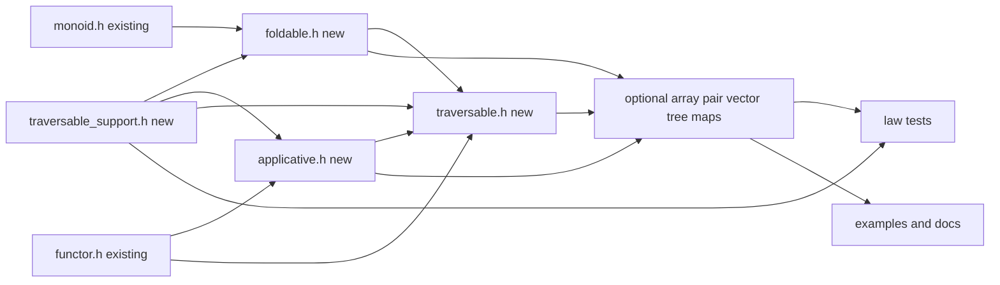
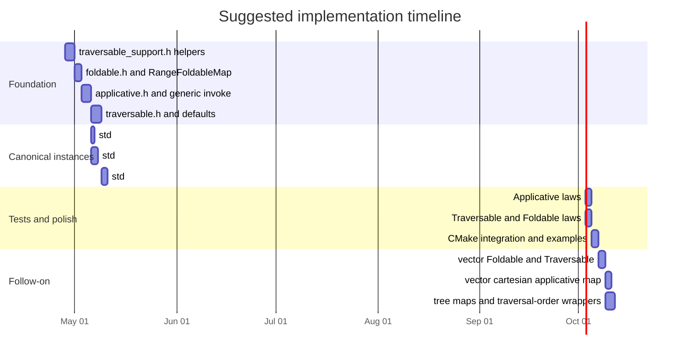

# Designing Foldable Traversable and Applicative in concept_map Style

## Executive summary

This report recommends extending `concept_map` with three new interfaces that preserve the repository’s current style while handling the extra demands of higher-kinded container families. The best fit is: `Foldable` as **`fold_map`-first**, `Traversable` as **`traverse`-first with an explicit applicative map parameter**, and `Applicative` as a **public invoke-first façade** backed by internal `pure` and either `liftA2` or `ap`. That preserves the repo’s façade-plus-`*_concept_map<T>` idiom for users, while adding just enough family/rebind machinery internally to support “same container family, different element type” operations cleanly. The current repository already uses variable-template lookup, façade types with defaults, and C++23-style explicit object parameters for `Functor` and `Monoid`, so the new interfaces should look like natural extensions rather than a separate subsystem. citeturn6view0turn6view5

The primary literature supports this split cleanly. McBride and Paterson present applicative programming as applying a pure function to effectful arguments, which maps naturally to a C++ `invoke(f, fa, fb, ...)` surface. Hackage’s `Applicative` class still states the minimal complete definition as `pure` plus either `<*>` or `liftA2`, and also derives `fmap` from applicative structure. Hackage’s `Traversable` documentation recommends implementing `traverse` explicitly rather than only `sequenceA`, defines `fmapDefault` and `foldMapDefault` through `Identity` and `Const`, and states the identity, naturality, and composition laws. Hackage’s `Foldable` docs permit `foldMap` or `foldr` as minimal definitions, but in this repository `foldMap` is the better primitive because `Monoid` already exists as a concept map. citeturn9view3turn9view2turn7view2turn6view5turn6view6

The crucial design boundary is that `Traversable` is **not** just “anything iterable.” Hackage describes traversables as structures that can be mapped effectfully from left to right while rebuilding outputs of the **same shape**, and UITBAF sharpens that into the representation-theorem claim that lawful traversables correspond to finitary containers with a shape-and-contents decomposition. In C++, that means a blanket `RangeFoldableMap` is reasonable, but a blanket `RangeTraversableMap` is not: generic ranges often lack a stable same-family reconstruction story. Lawfulness should therefore drive the instance set: `std::optional`, `std::array<N>`, `std::pair<M, _>`, `std::vector` for `Foldable`/`Traversable`, and trees with explicitly chosen traversal order. citeturn12search3turn7view5turn7view0

Unspecified items should be stated explicitly for the successor. Assume a **C++20 baseline**, but prefer code that is **C++23-compatible** and future-friendly for C++26/29, because the existing repo already uses C++23 idioms. Assume **Catch2 for new tests unless the successor is told otherwise**, but note that the current public `concept_map` repository uses **GTest** in CMake. Follow the existing repo’s layout conventions under `src/smd/conceptmap/`. The exact tree type is unspecified; the report therefore treats trees as a family of follow-on instances rather than hard-coding one concrete definition. citeturn10view2turn10view0

## Assumptions and design constraints

The repository style matters as much as the abstract theory. In the public `concept_map` code, `Functor` is a façade template over an implementation map and dispatches through `functor_concept_map<C>`; `Monoid` uses the same pattern with `monoid_concept_map<T>`, deriving defaults such as `concat` or `identity` where possible. This means the new interfaces should preserve four visible properties: a façade object with named operations, a variable-template dispatch point, defaults expressed in terms of other operations when lawful, and the ability to pass an explicit map object when default lookup is not appropriate. That consistency is more valuable here than inventing an entirely new customization mechanism. citeturn6view0

There is an explicit language-version tension. The user wants the successor to assume C++20 unless told otherwise, but the current repository already uses **deducing this** (`this auto&& self`) and newer ranges algorithms. A successor should therefore write APIs that are semantically valid in C++20, but may present code in a C++23-friendly style with a clear note when a C++20-compatible rewrite is trivial. In practice, that means: keep the design independent of any single feature, but allow façade implementations to use explicit object parameters and stronger tuple-like constraints when the toolchain supports them. citeturn10view0turn10view2

Lawfulness is a hard constraint, not optional polish. `Applicative` must satisfy identity, composition, homomorphism, and interchange. `Traversable` must satisfy naturality, identity, and composition, and consequently `traverse pure = pure`. `Foldable` must make `fold = foldMap id`, and Hackage states the `foldl` equivalence through `Dual . Endo`. These laws should shape the interface choices: for example, if `Traversable` is defined only through `sequenceA` while `Functor` uses `fmapDefault`, Hackage warns about recursion issues, which is a concrete reason to make `traverse` the primitive. citeturn6view2turn6view3turn6view4turn7view0turn6view6turn6view7

The remaining unspecified items should be surfaced, not guessed. The exact compiler and standard library combination is unspecified beyond the C++20/C++23 guidance; the exact tree representation is unspecified; whether the repo should continue to use GTest or migrate to Catch2 is unresolved; and whether any non-lawful “convenience” applicatives should be exposed for `std::vector` is likewise a policy choice. The successor should treat these as explicit decision points rather than silently filling them in. citeturn12search3turn9view0

## Minimal primitives and public API

For `Applicative`, the public API should center on an **invoke-first** operation because that is the most faithful C++ rendering of applicative programming with effects. The primary user-facing operation should therefore be a family of overloads like `invoke(f, fa, fb, ...)` and `invoke(map, f, fa, fb, ...)`. Internally, however, the implementor contract should still align with Hackage: every applicative family provides `pure`, and then at least one of `liftA2` or `ap`; if both are present, they should agree with the defaults. Hackage’s current docs are explicit that the minimal complete definition is `pure` plus either `<*>` or `liftA2`, and they also state the derived identity `fmap f x = pure f <*> x`, which is useful when testing consistency between `Functor` and `Applicative`. citeturn9view3turn9view2

For `Foldable`, the required primitive should be `fold_map`, even though Hackage technically allows `foldMap` or `foldr`. In this repository, `fold_map` aligns much better with the preexisting `Monoid` concept map and with the algebraic role of folding as “map into a monoid, then combine.” The rest of the interface can be derived: `fold = fold_map(id)`, `foldr` via `Endo`, and `foldl` via `Dual<Endo>`. That is exactly the pattern Hackage spells out, and it makes `Foldable` stand on its own without requiring `Functor` or `Traversable`. citeturn6view5turn6view6turn6view7

For `Traversable`, the primitive should be `traverse`, and the C++ API should take an **explicit applicative map parameter**:

```cpp
template<class AppMap, class C, class F>
constexpr auto traverse(AppMap app, C&& c, F&& f);
```

This explicit `app` argument is not mere ceremony. Hackage says `traverse` maps each element to an applicative action, evaluates the actions left-to-right, and rebuilds a structure of the same shape. In C++, if the structure is empty, the implementation often needs to produce `pure empty_shape` without any mapped element from which to infer the applicative family or target family semantics. Passing `app` explicitly resolves that problem and also makes applicative policy visible when a representation supports more than one lawful applicative. citeturn12search3turn8view2

The public API should explicitly lean on `std::invocable`, `std::invoke`, and `std::apply`. `std::invocable` is defined in terms of whether a callable can be called via `std::invoke`. `std::invoke` covers free functions, lambdas, function objects, member functions, and member data pointers. `std::apply` calls a callable with the elements of a tuple-like object, and in modern C++ tuple-like includes `std::tuple`, `std::pair`, and `std::array`. Those three facilities are therefore the natural standard-library substrate for an invoke-first applicative façade and for a generic variadic fallback implementation. citeturn10view2turn10view3turn10view1

## Dispatch strategy and variadic invoke

The visible dispatch surface should remain the repository’s familiar `*_concept_map<C>` pattern, but the implementation should use a **hybrid** strategy: concrete-type maps on the outside, family tags and rebinding traits internally. Pure concrete-type dispatch is fine for `Foldable`, which only consumes a `C`, but `Applicative::pure` and `Traversable::traverse` must change the element type while staying inside the same family. That makes a family notion unavoidable. The pragmatic solution is to keep `applicative_concept_map<C>`, `foldable_concept_map<C>`, and `traversable_concept_map<C>` as public entry points, but let them delegate to family machinery such as `family_tag_t<C>` and `rebind_t<C, U>` when a family implementation is shared across concrete instantiations. citeturn6view0turn12search5

A concise representation strategy is: `family_tag_t<std::array<T,N>> = array_family_tag<N>`, `family_tag_t<std::pair<M,A>> = pair_family_tag<M>`, and named map objects such as `vector_cartesian_applicative_map` rather than a default `applicative_concept_map<std::vector<T,Alloc>>`. That last point is important. Hackage distinguishes ordinary list applicative behavior and `ZipList` behavior, and the docs show that ZipList has its own Applicative, Foldable, and Traversable instances. In other words, zip behavior is not just “the list instance with a tweak”; it is a separate semantic choice embodied in a separate wrapper. That strongly suggests named maps or wrappers in C++ rather than one polymorphic default on raw `std::vector`. citeturn9view0turn12search3

| Option | Strengths | Weaknesses | Recommendation |
|---|---|---|---|
| Concrete-type `*_concept_map<C>` | Matches current repo; simplest visible API | Poor fit for rebinding families; duplicates logic across `array<T,N>` and `pair<M,A>` | Use as the public façade |
| Family-tag dispatch | Natural for higher-kinded family behavior; one implementation per family | Less obviously aligned with current repo if exposed directly | Use internally |
| Hybrid dispatch | Preserves repo look-and-feel, supports rebinding, named semantics, and explicit maps | Slightly more machinery | Best overall |
| Repeated `ap` / curried recursion | Theoretically direct from Applicative laws | Verbose in C++; deeper template instantiation chains | Keep as a secondary derivation |
| Repeated `liftA2` recursion | Simple binary structure | Less ergonomic for high arity | Accept as an internal fallback |
| Tuple accumulation + `liftA2` + `std::apply` | Best fit for invoke-first C++; leverages standard library callable model | More tuple machinery and potential copies | Preferred generic fallback |
| Raw `std::vector` cartesian Applicative | Lawful analogue of list nondeterminism | May explode combinatorially | Offer only as an explicit named map |
| Raw `std::vector` zip Applicative | Operationally intuitive | Not the standard lawful Applicative on unconstrained finite vectors | Do not make default; prefer wrappers or fixed-size families |

This table synthesizes the repo design with Hackage’s semantics and the standard library callable model. The two most important practical conclusions are: use the hybrid dispatch model, and do not pretend that one default vector applicative is canonical. citeturn9view0turn8view0turn10view0

The preferred variadic `invoke` fallback is **tuple accumulation plus `liftA2` plus `std::apply`**. The idea is to start from `pure(tuple{})`, use `liftA2` repeatedly to append successive pure values into a tuple held in the applicative context, and then once at the end `map` or `liftA2` the pure callable over that tuple with `std::apply(std::invoke, ...)`. This mirrors the semantic account from Applicative programming—pure function plus effectful arguments—while staying natural in modern C++. Because `std::apply` is specified in terms of `INVOKE` and tuple-size/index-sequence expansion, the approach is also mechanically aligned with the standard library rather than inventing a parallel calling convention. citeturn10view1turn10view3

```cpp
template<class App, class F, class... AXs>
constexpr auto invoke(App app, F&& f, AXs&&... axs) {
    auto acc = app.pure(std::tuple<>{});

    auto push = []<class Tup, class X>(Tup&& tup, X&& x) {
        return std::tuple_cat(
            std::forward<Tup>(tup),
            std::tuple<std::decay_t<X>>(std::forward<X>(x)));
    };

    ((acc = app.liftA2(push, std::move(acc), std::forward<AXs>(axs))), ...);

    return app.map(
        std::move(acc),
        [fn = std::forward<F>(f)](auto&& tup) mutable -> decltype(auto) {
            return std::apply(
                [&fn](auto&&... xs) -> decltype(auto) {
                    return std::invoke(fn, std::forward<decltype(xs)>(xs)...);
                },
                std::forward<decltype(tup)>(tup));
        });
}
```

This should be the **generic** path, not the only path. Specialized families such as `std::optional` and `std::array<N>` should be free to override `liftA2`, `ap`, or even `invoke` directly for clarity or performance. citeturn9view1turn10view1

## Foldable and Traversable design

`Foldable` should be presented as monoid-powered summarization. The core operation is `fold_map(c, f)` for some monoid map, and this is precisely what makes it integrate naturally with the existing `Monoid` component in the repository. Hackage makes `foldMap` one of the minimal complete definitions, states `fold = foldMap id`, and gives the `foldl` formula through `Dual . Endo`. That means the implementor contract can be kept tight: require `fold_map`, derive the rest. This also makes the law story teachable in the talk and useful in code. citeturn6view5turn6view6turn6view7

A blanket `RangeFoldableMap` is a good default because folding only requires a linear observation of elements, not a rebuild of the same family. Hackage’s `Foldable` docs note that the class is broader than `Functor`, which is exactly why C++ ranges and containers with constrained element behavior can still be made foldable. The caution is semantic, not legal: C++ folds over ranges are typically eager and resource-bearing, so a generic range fold should document that it offers ordinary eager reduction semantics, not Haskell-like productivity or laziness over infinite structures. If you need early termination, expose specialized algorithms rather than relying on `foldr` folklore. citeturn6view5turn8view1

`Traversable` should be kept narrower and more explicit. Hackage describes traversables as structures that can be transformed by performing applicative actions on elements from left to right while keeping the **same graph of intermediate nodes and leaves** for tree-like examples. It also explicitly says the original structure can be reconstructed from its spine and element list. UITBAF generalizes the same insight by showing that traversable functors correspond to finitary containers. In C++ terms, that is an argument for implementing `Traversable` only for owned, reconstructible families with well-defined traversal order and a workable rebind story. citeturn7view5turn12search3turn7view0

Hackage also provides the key defaults that should explain your architecture to a successor. `fmapDefault` is traversal through `Identity`, and `foldMapDefault` is traversal through `Const`. The docs explicitly warn against relying on `sequenceA . fmap` as the only story and recommend implementing `traverse` directly. That is especially important in a repository that already has a reusable `Functor` façade: the right relation is “Traversable can derive compatible Functor and Foldable behavior,” not “Traversable is only a thin adapter over an existing mapping view.” citeturn12search3turn7view2turn7view0

## Recommended instances and law suite

The recommended first-wave instances are `std::optional`, `std::array<T, N>`, `std::pair<M, A>`, and `std::vector<T, Alloc>` for `Foldable` and `Traversable`. `std::optional` is the canonical “zero-or-one slot” structure. `std::array<N>` is the best first fixed-size zippy applicative in C++, because `pure(x)` can lawfully replicate across the fixed shape. Hackage’s examples for same-shape traversal and tuple-like structures map directly to `std::array` and `std::pair`, and the tuple instance `Monoid a => Applicative ((,) a)` is explicitly documented, which makes `std::pair<M, A>` a natural writer-like family when `M` has a `Monoid` concept map. citeturn12search3turn12search2

`std::vector` deserves a split policy. For `Foldable` and `Traversable`, default left-to-right behavior is fine, provided you handle element-type change through `std::allocator_traits<Alloc>::rebind_alloc<U>`. `allocator_traits` is the standard mechanism for rebinding allocator-aware families to a new `value_type`, which is exactly what `traverse` and `pure` need in a family-aware implementation. For `Applicative`, the default should be **none**. If you want list/cartesian behavior, expose it as a named map. If you want zip behavior, prefer a wrapper or a fixed-size family, because Hackage surfaces zip semantics through `ZipList`, not through the ordinary list Applicative. citeturn13search1turn9view0turn8view0

Trees should come after the simpler container families, and their traversal order should be explicit. Hackage’s `Data.Traversable` docs discuss in-order, pre-order, and post-order tree traversals as distinct lawful choices, implemented through wrappers. That makes a strong C++ design hint: support either one canonical default traversal order per tree family or named wrappers/tags for alternative orders. Do not smuggle order changes into a single default map. This also gives the test suite an obvious structure: use a writer-like or `Const<std::vector<visit>>` effect to observe traversal order. citeturn6view11turn7view0

The law suite should be organized around three helper applicatives: `Identity`, `Const<M>`, and `Compose<F, G>`. Hackage explicitly names `fmapDefault` and `foldMapDefault` for the first two, and gives the traversable composition law in terms of `Compose`. The resulting tests should include: Applicative identity, composition, homomorphism, interchange, and `fmap f x == pure f <*> x`; Traversable naturality, identity, composition, and `traverse pure = pure`; Foldable `fold = foldMap id`, plus `foldl`/`foldr` checks where you expose them. These helpers should live in `traversable_support.h` rather than only in the test files, because they are both law-test tools and default-derivation tools. citeturn7view0turn12search3turn9view2

## Code skeletons, layout, and migration plan

A concise `std::optional` skeleton should show the whole intended layering: canonical concept-map specialization, `pure`, and a natural `liftA2`. In C++23-facing code you can use explicit object parameters if you want to mirror the current repo style; in strict C++20, ordinary member functions or free functions are the more portable fallback. The key point is semantic, not syntactic:

```cpp
template<class T>
struct OptionalApplicativeMap {
    template<class U>
    constexpr auto pure(U&& u) const
        -> std::optional<std::decay_t<U>> {
        return std::optional<std::decay_t<U>>(std::forward<U>(u));
    }

    template<class F, class A, class B>
    constexpr auto liftA2(F&& f,
                          std::optional<A> const& x,
                          std::optional<B> const& y) const
        -> std::optional<std::invoke_result_t<F&, A const&, B const&>> {
        if (!x || !y) return std::nullopt;
        return std::invoke(std::forward<F>(f), *x, *y);
    }
};
```

This instance is the simplest place to prove that the design works, because it exercises `pure`, `liftA2`, short-circuiting traversal, and law tests without needing any family-level allocator or indexing machinery. citeturn8view1turn9view3

For `std::array<T, N>`, the family shape is fixed at compile time and the natural applicative is pointwise:

```cpp
template<std::size_t N>
struct ArrayApplicativeFamily {
    template<class U>
    using rebind = std::array<U, N>;

    template<class U>
    constexpr auto pure(U const& u) const -> rebind<U> {
        rebind<U> out{};
        out.fill(u);
        return out;
    }

    template<class F, class A, class B>
    constexpr auto liftA2(F&& f,
                          rebind<A> const& xs,
                          rebind<B> const& ys) const
        -> rebind<std::invoke_result_t<F&, A const&, B const&>> {
        rebind<std::invoke_result_t<F&, A const&, B const&>> out{};
        for (std::size_t i = 0; i < N; ++i)
            out[i] = std::invoke(std::forward<F>(f), xs[i], ys[i]);
        return out;
    }
};
```

This is the best first “zippy” instance because the shape is fixed and finite. It also illustrates why family tags are useful: the family is not just `array<T, N>` as a concrete type, but “array of length `N`” as a rebinding family. citeturn10view1turn12search3

The layout should follow the existing repository conventions by adding `src/smd/conceptmap/applicative.h`, `foldable.h`, `traversable.h`, and `traversable_support.h`, plus companion tests `applicative.t.cpp`, `foldable.t.cpp`, and `traversable.t.cpp`. The current public `concept_map` CMake installs only `functor.h` and `monoid.h` in its file set and wires tests through GTest, so a successor should either intentionally extend that pattern or intentionally migrate the test harness if Catch2 is required. Mixing the two without comment would be a mistake. citeturn6view0

A sensible migration checklist is: add `traversable_support.h` first with `Identity`, `Const`, `Compose`, `Endo`, `Dual`, and rebind traits; add `foldable.h` next because it depends only on `Monoid` and support utilities; add `applicative.h` with the generic tuple-accumulation fallback and canonical `optional`/`array` instances; then add `traversable.h` and derive `fmapDefault` and `foldMapDefault`; then add `RangeFoldableMap`; then broaden to `vector`, `pair`, and trees; then finish with law tests and examples. This order is both dependency-aware and demo-friendly. citeturn7view2turn12search3





## Successor instructions and follow-up prompts

The successor LLM should produce code in a **modern C++23-friendly style with a C++20-compatible fallback where practical**, include tests, and preserve the repository’s concept-map façade style. It should assume Catch2 if explicitly asked, but note the existing GTest pattern if working directly in the public repo. It should also include diagrams and a short implementation timeline in its design notes, because the architecture is much easier to communicate when the layering and task order are visible. citeturn10view2turn6view0

The shortest prioritized task list for the successor is:

- Implement `applicative_concept_map<std::optional<T>>` with `pure`, `liftA2`, and `invoke`.
- Implement `RangeFoldableMap` and `fold_map`-first `foldable.h`.
- Implement `traversable_support.h` with `Identity`, `Const`, `Compose`, `Endo`, `Dual`, and rebind traits.
- Implement `std::array<N>` pointwise families for `Applicative`, `Foldable`, and `Traversable`.
- Write law tests for `optional` and `array`, then produce small end-to-end examples.

These tasks intentionally lock down the architecture before the more policy-heavy work around `vector` applicatives and tree traversal order. citeturn12search3turn9view3

The most useful follow-up prompts to ask next are:

- “Implement `applicative.h` and `traversable_support.h` in repo style, with a generic tuple-accumulation fallback and `std::optional` tests.”
- “Implement `foldable.h` as `fold_map`-first, including `RangeFoldableMap`, `Endo`, and `Dual`, and verify `fold = foldMap id` in tests.”
- “Implement `traversable.h` with explicit applicative-map traversal and derive `fmapDefault` and `foldMapDefault` through `Identity` and `Const`.”
- “Add `std::array<N>` and `std::pair<M, A>` instances, explain the family-tag/rebind machinery, and include code examples.”
- “Design explicit named maps for vector cartesian applicative behavior and explain why raw-vector zip is not a lawful default.”
- “If strict C++20 support is required, rewrite the deducing-this façade style into a C++20-compatible CRTP or free-function equivalent.”

The main open questions remain policy questions rather than research gaps: whether to retain GTest or move to Catch2 in-repo, whether to expose any raw-vector zip semantics at all, which exact tree type should become the canonical traversable demo, and how aggressive to be about C++23-only syntax in the first implementation pass. Those should be decided explicitly before broadening the instance set beyond `optional`, `array`, and `pair`. citeturn9view0turn12search3