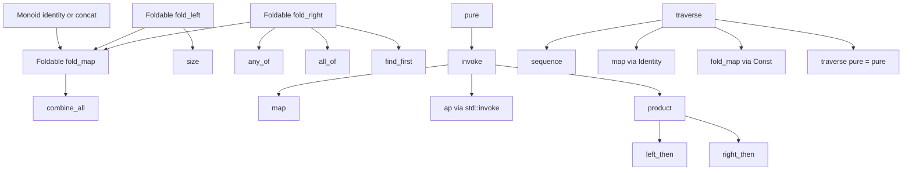

# Implementing Foldable Applicative Traversable in C++ with concept_map Style

## Executive summary

Your existing `concept_map` prototype already establishes the core mechanical pattern you want to extend: a variable-template lookup object specialized by type, record-shaped typeclass objects rather than ad hoc overload sets, explicit surfacing of basis operations via `using`, and defaults implemented in a CRTP-like layer using explicit object parameters. In the current public code, `Functor` is a record inheriting `Impl<C>`, `functor_concept_map<T>` defaults to `std::false_type{}` and is specialized for `std::optional<T>`, `beman::optional::optional<T>`, and range-like unary templates, while tests already demonstrate all three use modes you care about: ordinary lookup, a non-type template parameter defaulting to the looked-up map object, and direct invocation of the record. `Monoid` follows the same pattern and uses `identity` or `concat` as basis operations while deriving the other. That is the right foundation for `Foldable`, `Applicative`, and `Traversable`. citeturn11view0turn11view1turn13view0turn3view1

The most important design recommendation is this: make the **public generic API** for applicatives center on a variadic `invoke` operation, not on exposing curried `ap` as the teaching surface. McBride and Paterson show that applicative programs normalize to a single pure function applied to a fixed sequence of effectful arguments, `pure f <*> u1 <*> ... <*> un`; that is almost a direct specification for a C++ `invoke(f, ua, ub, uc...)` API. Cats also makes the same conceptual split: `Applicative` extends a weaker `Apply`, and `map` can be defined from `ap(pure(f))`. In your C++ library, `ap` should exist, but as a **derived compatibility operation**: `ap(ff, fa) := invoke(std::invoke, ff, fa)`. That keeps the pedagogical surface aligned with the paper while still preserving classical applicative structure for proofs and derivations. citeturn27view2turn20view4

For `Foldable`, I recommend **Cats- and ranges-aligned names**: `fold_left`, `fold_right`, and `fold_map`, with `combine_all`, `size`, `empty`, `any_of`, `all_of`, `find_first`, and `to_vector` derived on top. For `Traversable`, use `traverse` and `sequence`, not Haskell’s historical `sequenceA`; PureScript already presents `sequence` as the primary applicative-facing name, and Hackage documents `sequenceA = traverse id` while also explicitly stating that `Functor` and `Foldable` can be derived from `traverse` via `Identity` and `Const`. Those are exactly the derivation hooks you want for your C++ record defaults. citeturn20view2turn29view1turn29view3

A crucial practical point is portability. Explicit object parameters are a C++23 feature, and cppreference currently lists support across recent GCC, Clang, and MSVC versions, but with some cells still marked partial; this means the **architecture** should use explicit object parameters where available, but you should isolate that dependency behind a narrow layer and keep the outer generic call objects stable. The good news is that this matches your style anyway: the public surface should be algorithm function objects that route to looked-up record objects, much like `std::ranges` algorithms are algorithm function objects that inhibit ADL. citeturn24view2turn20view10turn25view0turn21view0

For the project plan, the best near-term path is:

1. keep `Monoid` and `Functor` as precedents, but move the `cppnow26` work into `src/smd/typeclass/` with `.hpp/.cpp/.t.cpp` triples, matching the `trees` project’s co-located source layout and presentation build flow;
2. implement `Foldable` first, because it is the least controversial and gives immediate value for `fringetree` and future `fingertree`;
3. implement `Applicative` next around `pure + invoke`, with `ap`, `product`, and sequencing helpers derived;
4. implement `Traversable` last, with `traverse` as the only recommended required operation and `sequence`, `map`, and `fold_map` derived via `Identity` and `Const`;
5. defer the final choice of the **default tree applicative semantics** unless you are prepared to make it explicit per wrapper or per concept map. That choice is real, and the typeclass-object approach actually gives you room to support more than one lawful semantics. citeturn5view2turn8view0turn12view1turn14view2turn14view3

## Source aligned constraints and design principles

The public `concept_map` talk notes are very clear about the intended direction: the point is to recover a level of indirection that C++ lost with Concepts-lite, stay tied to the type system, avoid virtual dispatch and type erasure, avoid ADL, and prefer **object lookup over overload lookup**. The same notes already frame the typeclass object as “a record” of operations associated with the type, and the existing implementation realizes that with variable templates plus record objects. That philosophy should stay unchanged as you add `Foldable`, `Applicative`, and `Traversable`. citeturn3view1

Your current repository code demonstrates exactly the reusable pattern. `Functor` is a template record that inherits an implementation object and exposes operations through member functions with explicit object parameters; `functor_concept_map<T>` is a variable template defaulting to `std::false_type{}` and then specialized for actual instance families; concrete map types use `using Impl::map` so that defaults and basis operations coexist without building a separate overload lattice. `Monoid` mirrors that structure, and its `MonoidRequirements` concept already shows the style you should copy: accept one of several minimal bases and derive the rest in the wrapper. citeturn11view0turn11view1turn9view3turn9view4

The current functor tests are also an important design signal. They show a function template parameterized as `template <typename P, const auto &functor = functor_concept_map<P>>`, and then use `functor.map(...)`. That is the best evidence in your current codebase that **non-type template parameter injection of the looked-up typeclass object** is not just an idea but already a working style. So for the next phase, every generic algorithm surface should support the same three lookup modes:

- implicit lookup by variable template;
- explicit record object argument;
- non-type template parameter for compile-time pinning and overload disambiguation. citeturn13view0

Your public `cppnow26/trees` outline, meanwhile, gives the talk structure but only at a high level: foldables as sequence-like views of structures, applicatives as “pure function applied to funny arguments,” traversables as shape-preserving effectful traversals, measured trees as a monoidal case study, and `fingertree` as the endgame. The repository’s current `trees` project structure is also useful: it uses a co-located `src` layout, assumes current toolchains on `PATH`, runs tests as part of the build workflow, and can produce slides from org-transcluded code via `make presentation`. That strongly supports a source layout where every slide snippet is taken directly from compilable project files rather than a separate slide-only artifact. citeturn3view0turn5view2turn8view0

The theoretical sources line up well with that practical structure. McBride and Paterson’s applicative paper motivates `Applicative` as weaker than `Monad`, introduces the canonical form “one pure function applied to a fixed sequence of effectful arguments,” and identifies applicatives categorically as strong lax monoidal functors. Gibbons and Oliveira argue that `traverse` captures the essence of the internal iterator pattern because it combines mapping and accumulation while preserving shape. Bird, Gibbons, Mehner, Voigtländer, and Schrijvers then sharpen the traversable story by showing that lawful traversals decompose structures into shape and contents and support backward as well as forward reasoning. Hackage and PureScript documentation finally give implementation-level laws and defaults: `Traversable` derives `Functor` and `Foldable` via `Identity` and `Const`, `Foldable` operations can be derived from a small basis, and `sequence` is just `traverse identity`. citeturn26view0turn27view2turn27view1turn26view1turn26view2turn29view3turn20view2turn20view3turn30view0

One more source-aligned point matters for naming. Your public slide outline currently uses **Applicable**, but the literature and the major library ecosystems all use **Applicative**. Keeping the *typeclass name* as `applicative` is the better choice for recognizability and for aligning with the cited laws and documentation; if you want the talk prose to emphasize “applicable invocation,” that can be a subtitle or a slide phrase, but not the core typeclass identifier. Likewise, `map` is preferable to `fmap`, while `fold_left` and `fold_right` are better than `foldl` and `foldr` because they align with `std::ranges` naming. PureScript and Cats both support that naming direction better than historical Haskell names do. citeturn3view0turn26view3turn20view4turn20view5turn20view2turn20view3

## Proposed C++ interfaces

The design below keeps your `concept_map` mechanics intact while making the typeclass surfaces more explicit and easier to teach. The comparison table summarizes the recommended basis for each typeclass and which operations should be derived automatically.

The table below synthesizes the current `concept_map` implementation pattern, the existing `Monoid` basis-vs-default style, and the primary library/documentation sources for `Foldable`, `Applicative`, and `Traversable`. citeturn11view0turn11view1turn20view2turn20view3turn20view4turn20view5turn29view3turn30view0

| Typeclass | Recommended core name | Recommended required basis | Acceptable alternate basis | Derived operations |
|---|---|---|---|---|
| Foldable | `foldable` | `fold_left`, `fold_right` | one of `fold_left`, `fold_right`, `fold_map` | `fold_map`, `combine_all`, `size`, `empty`, `any_of`, `all_of`, `find_first`, `to_vector` |
| Applicative | `applicative` | `pure`, `invoke` | `pure` + `ap`, or `pure` + binary `product` | `map`, `ap`, `product`, `left_then`, `right_then`, `tupled`, `lift` |
| Traversable | `traversable` | `traverse` | `sequence` | `sequence`, `map` via `Identity`, `fold_map` via `Const`, flipped `for_each`-style helper |

My strongest recommendation is to define the **public generic call surface** as algorithm function objects, parallel to `std::ranges`, and keep the looked-up record object separate. This preserves your “typed open extension” story and keeps ADL out of the core. `std::ranges` describes its algorithms as algorithm function objects that are not visible to ADL; your approach should do the same, except routed through a record map selected by type. citeturn25view0turn3view1

A compact shared lookup pattern looks like this:

```cpp
namespace smd::typeclass {

template<class T>
inline constexpr auto foldable_concept_map = std::false_type{};

template<class T>
inline constexpr auto applicative_concept_map = std::false_type{};

template<class T>
inline constexpr auto traversable_concept_map = std::false_type{};

template<class T>
concept has_foldable_map =
    !std::same_as<decltype(foldable_concept_map<std::remove_cvref_t<T>>), std::false_type>;

template<class T>
concept has_applicative_map =
    !std::same_as<decltype(applicative_concept_map<std::remove_cvref_t<T>>), std::false_type>;

template<class T>
concept has_traversable_map =
    !std::same_as<decltype(traversable_concept_map<std::remove_cvref_t<T>>), std::false_type>;

inline constexpr struct fold_left_fn {
    template<class Xs, class State, class F,
             auto const& M = foldable_concept_map<std::remove_cvref_t<Xs>>>
        requires has_foldable_map<Xs>
    constexpr decltype(auto) operator()(Xs&& xs, State init, F&& f) const {
        return M.fold_left(std::forward<Xs>(xs), std::move(init), std::forward<F>(f));
    }

    template<class Map, class Xs, class State, class F>
    constexpr decltype(auto) operator()(Map const& m, Xs&& xs, State init, F&& f) const {
        return m.fold_left(std::forward<Xs>(xs), std::move(init), std::forward<F>(f));
    }
} fold_left{};

} // namespace smd::typeclass
```

That gives you the three lookup styles you wanted:

```cpp
auto s1 = smd::typeclass::fold_left(xs, init, f);                    // implicit map lookup
auto s2 = smd::typeclass::fold_left(my_foldable_map, xs, init, f);   // explicit object
template<class Xs, auto const& M = foldable_concept_map<Xs>>
auto algo(Xs&& xs) { return M.fold_left(std::forward<Xs>(xs), 0, plus); } // NTTP
```

### Foldable

On naming, I recommend:

- `fold_left`
- `fold_right`
- `fold_map`
- `combine_all`
- `size`
- `empty`
- `find_first`
- `any_of`
- `all_of`
- `to_vector`

This matches Cats concept names better than Haskell historical names and matches `std::ranges::fold_left` / `fold_right` exactly where possible. Cats treats `foldLeft` and `foldRight` as the two basic operations; PureScript presents `foldl`, `foldr`, and `foldMap` with named defaults; Haskell’s minimal complete definition is `foldMap` or `foldr`. For your C++ library, I would keep all three in the interface but **recommend direct definitions of both directions** for trees and other structured containers, because that makes order explicit and avoids fragile higher-order default cycles. PureScript explicitly warns that some default combinations are unsafe due to mutual recursion, and Haskell’s documentation says hand-tuned definitions often benefit from explicitly defining more than the strict minimum. citeturn20view5turn20view3turn30view0turn31view2

A `Foldable` record in your style should therefore look like this conceptually:

```cpp
template<class Impl>
concept FoldableRequirements =
    requires(Impl impl, typename Impl::container_type xs,
             typename Impl::state_type init, typename Impl::fold_left_fn fleft) {
        impl.fold_left(xs, init, fleft);
    } ||
    requires(Impl impl, typename Impl::container_type xs,
             typename Impl::state_type init, typename Impl::fold_right_fn fright) {
        impl.fold_right(xs, init, fright);
    } ||
    requires(Impl impl, typename Impl::container_type xs,
             typename Impl::map_fn mapf) {
        impl.fold_map(xs, mapf);
    };

template<class Impl>
struct Foldable : protected Impl {
    using Impl::fold_left;
    using Impl::fold_right;
    using Impl::fold_map;

    // derived defaults guarded so they do not recurse into each other
    // combine_all, size, empty, any_of, all_of, find_first, to_vector
};
```

In practice, the concept should not literally use `Impl::container_type` or `state_type`; make it more generic than the sketch. The important point is structural: **mirror `MonoidRequirements`**, accept one of several bases, and derive the rest with compile-time selection rather than mutual default recursion. That is exactly the existing style of your `Monoid` wrapper. citeturn11view1

For generic ranges, use a fallback map object that forwards to `std::ranges::fold_left` and, when available, `std::ranges::fold_right`. The standard range fold algorithms use the same left- and right-associative equations you want in the API naming. `std::ranges::fold_left` evaluates `f(f(...f(init, x1), x2)..., xn)`, while `fold_right` evaluates `f(x1, f(x2, ...f(xn, init)))`. citeturn20view8turn20view9

```cpp
template<std::ranges::input_range R>
struct range_foldable_base {
    template<class State, class F>
    constexpr auto fold_left(this auto&&, R&& r, State init, F&& f) {
        return std::ranges::fold_left(std::forward<R>(r), std::move(init), std::forward<F>(f));
    }

    template<class State, class F>
        requires std::ranges::bidirectional_range<R>
    constexpr auto fold_right(this auto&&, R&& r, State init, F&& f) {
        return std::ranges::fold_right(std::forward<R>(r), std::move(init), std::forward<F>(f));
    }
};
```

For trees, the fold order must be documented as part of the instance. Haskell’s `Foldable` tree examples use a depth-first left-root-right order for a binary tree, and the docs explicitly spell out the recursive definitions of `foldr`, `foldMap`, and `foldl` for that case. That makes a good precedent for your `fixpoint_tree` and any binary-tree teaching examples. For sequence-like finger trees, the order should simply be the left-to-right sequence order. citeturn31view2

### Applicative

The key public names should be:

- `pure`
- `invoke`
- `ap`
- `product`
- `left_then`
- `right_then`
- `lift` or `lift_n` as aliases if you want them

The crucial choice is that `invoke` is the **primary user-facing generic algorithm**, while `ap` is derived. McBride and Paterson’s canonical form is the strongest possible argument for this: applicative expressions normalize to a pure function applied to a fixed sequence of effectful arguments, exactly the shape of a variadic `invoke`. Cats also confirms the core derivation relation `map(fa)(f) = ap(pure(f))(fa)`, which your defaults can retain even if users never see `ap` first. citeturn27view2turn20view4

I therefore recommend this interface rule:

- **Required, recommended basis**: `pure`, `invoke`
- **Derived**:
  - `map(fa, f) = invoke(f, fa)`
  - `ap(ff, fa) = invoke(std::invoke, ff, fa)`
  - `product(fa, fb) = invoke([](auto&& a, auto&& b) { return std::tuple{...}; }, fa, fb)`
  - `left_then(fa, fb)` and `right_then(fa, fb)` as projections from `product`

The important subtlety is that `ap` is still derivable even if `invoke` takes a **pure external callable**, because the external callable may itself be `std::invoke`, and the first applicative-contained argument may hold a callable. This is exactly why `invoke(std::invoke, ff, fa)` works as the derived applicative application. That is the cleanest way to satisfy your design brief without teaching currying first.

A useful C++ sketch is:

```cpp
template<class Impl>
struct Applicative : protected Impl {
    using Impl::pure;
    using Impl::invoke;

    template<class Fa, class F>
    constexpr auto map(this auto&& self, Fa&& fa, F&& f) {
        return self.invoke(std::forward<F>(f), std::forward<Fa>(fa));
    }

    template<class Ff, class Fa>
    constexpr auto ap(this auto&& self, Ff&& ff, Fa&& fa) {
        return self.invoke(std::invoke, std::forward<Ff>(ff), std::forward<Fa>(fa));
    }

    template<class Fa, class Fb>
    constexpr auto product(this auto&& self, Fa&& fa, Fb&& fb) {
        return self.invoke(
            []<class A, class B>(A&& a, B&& b) {
                return std::tuple<std::decay_t<A>, std::decay_t<B>>(
                    std::forward<A>(a), std::forward<B>(b));
            },
            std::forward<Fa>(fa), std::forward<Fb>(fb));
    }

    template<class Fa, class Fb>
    constexpr auto left_then(this auto&& self, Fa&& fa, Fb&& fb) {
        return self.invoke([](auto&& a, auto&&) { return std::forward<decltype(a)>(a); },
                           std::forward<Fa>(fa), std::forward<Fb>(fb));
    }

    template<class Fa, class Fb>
    constexpr auto right_then(this auto&& self, Fa&& fa, Fb&& fb) {
        return self.invoke([](auto&&, auto&& b) { return std::forward<decltype(b)>(b); },
                           std::forward<Fa>(fa), std::forward<Fb>(fb));
    }
};
```

For **overload resolution and constraints**, the best pattern is:

- require at least one applicative argument for `invoke`;
- accept any `F` that is `std::invocable` with the contained value types;
- use `std::invoke` consistently so member pointers and function objects behave like normal C++;
- do **not** make `invoke` itself a template-argument-heavy CPO; keep the algorithm function object simple and let the record object carry the real implementation. That is consistent with your “object lookup rather than overload lookup” principle. citeturn3view1

A realistic first instance is `std::optional<T>`:

```cpp
template<class T>
struct optional_applicative_base {
    template<class U>
    constexpr auto pure(this auto&&, U&& u) -> std::optional<std::decay_t<U>> {
        return std::optional<std::decay_t<U>>(std::forward<U>(u));
    }

    template<class F, class... Os>
    constexpr auto invoke(this auto&&, F&& f, Os&&... os)
        -> std::optional<std::invoke_result_t<F&, decltype(*os)...>>
    {
        if (((!os) || ...)) {
            return std::nullopt;
        }
        return std::optional<std::invoke_result_t<F&, decltype(*os)...>>(
            std::invoke(std::forward<F>(f), (*std::forward<Os>(os))...));
    }
};

template<class T>
struct optional_applicative_map : Applicative<optional_applicative_base<T>> {
    using optional_applicative_base<T>::pure;
    using optional_applicative_base<T>::invoke;
};

template<class T>
inline constexpr auto applicative_concept_map<std::optional<T>>
    = optional_applicative_map<T>{};
```

That instance gives the expected “first missing argument kills the whole invocation” behavior. The applicative laws themselves do not force “short-circuiting” as a universal semantic, but they do require consistent treatment of pure computations and composition; for a Maybe/Optional-like type, left-to-right empty propagation is the conventional and readable choice, and it fits the fixed-structure applicative story. McBride and Paterson explicitly describe applicative computations as fixed-structure effectful applications and note that order of genuinely effectful computations is preserved. citeturn27view2turn26view3

One special recommendation for trees: do **not** hard-code only one applicative interpretation unless you are sure you want it. Because your typeclass mechanism is object-based and open, you can support multiple lawful applicative records for the same data family, e.g. a sequence/cartesian applicative, a zip-like applicative wrapper, or a domain-specific shape-matching applicative. That flexibility is a feature, not a problem.

### Traversable

The core names should be:

- `traverse`
- `sequence`

Optionally later:

- `map_accum_left`
- `map_accum_right`
- a flipped convenience helper, perhaps `for_each_traverse` rather than plain `for_each`

The basis should be simple:

- **Recommended required operation**: `traverse`
- **Derived**:
  - `sequence(xs) = traverse(identity, xs)`
  - `map` via `Identity`
  - `fold_map` via `Const`
  - possibly `scan`/`map_accum` helpers later

This is the most source-backed part of the whole design. PureScript defines `sequence = traverse identity` and states the compatibility law `foldMap f = runConst <<< traverse (Const <<< f)`. Hackage states that every lawful `Traversable` gives `Functor` and `Foldable` through `fmapDefault` and `foldMapDefault`, and even provides the exact `Identity`/`Const` derivation story. It also explicitly recommends that instances should generally implement `traverse` directly rather than deriving it from `sequence`. citeturn20view2turn29view1turn29view3

A C++ skeleton should therefore look like:

```cpp
template<class Impl>
struct Traversable : protected Impl {
    using Impl::traverse;

    template<class Xs>
    constexpr auto sequence(this auto&& self, Xs&& xs) {
        return self.traverse(
            std::forward<Xs>(xs),
            []<class A>(A&& a) -> A&& { return std::forward<A>(a); });
    }

    template<class Xs, class F>
    constexpr auto map(this auto&& self, Xs&& xs, F&& f) {
        return run_identity(self.traverse(
            std::forward<Xs>(xs),
            [&](auto&& a) { return identity_box{std::invoke(f, std::forward<decltype(a)>(a))}; }));
    }

    template<class Xs, class F>
    constexpr auto fold_map(this auto&& self, Xs&& xs, F&& f) {
        return get_const(self.traverse(
            std::forward<Xs>(xs),
            [&](auto&& a) { return make_const(std::invoke(f, std::forward<decltype(a)>(a))); }));
    }
};
```

The laws you should document in comments and tests are the standard ones:

- naturality
- identity
- composition
- the derived purity consequence `traverse(pure) = pure`

Hackage gives those laws explicitly, including the statement that `fmap` should agree with traversal under `Identity` and `foldMap` should agree with traversal under `Const`. That gives you a fully source-backed testing story. citeturn29view3turn29view2

For tree instances, lawful traversal is the place where **shape preservation** is non-negotiable. The iterator/traversable papers explicitly use trees to show that traversal should preserve shape while visiting contents in a defined order, and they also show how a backwards applicative adapter reverses the order of effects without changing the structural reconstruction. That suggests a very good future extension: a `traverse_reverse` generic helper implemented with the `Backwards` adapter, without needing a second hand-built traversal per tree type. citeturn26view3turn28view3turn26view2

## Derivations laws and complexity

The derivation dependency structure is the part a successor LLM will most need to preserve, because it is where correctness, naming, and the code skeleton all meet.



The `Foldable` side is the most implementation-sensitive because C++ is eager and not Haskell-lazy. Haskell documents `foldr` as lazy in the accumulator and useful for short-circuiting or corecursion, while strict left folds are space-efficient reductions. In C++, you still want **both directional names**, but you should not promise Haskell-style laziness unless the accumulator type itself encodes delay. In practice, for this project, assume **finite, eager** structures and use right folds mainly for order and derivation clarity, not for infinite-data semantics. That is consistent with the papers’ tree examples and with current C++ range folds. citeturn30view3turn30view2turn20view8turn20view9

The `Foldable` derivations should follow these rules:

- `fold_map(xs, f, monoid)` from `fold_left`:
  - start with `monoid.identity()`;
  - update with `monoid.op(acc, f(x))`;
  - correctness follows directly from the left-fold equation plus monoid associativity and identity.
- `combine_all(xs)` is `fold_map(xs, identity, monoid)`.
- `size(xs)` is `fold_left(xs, std::size_t{0}, [](n, _) { return n + 1; })`.
- `empty(xs)` may be derived as `size(xs) == 0`, but if the instance can answer emptiness structurally in O(1), it should override.
- `find_first`, `any_of`, `all_of` should be implemented directly when the structure supports early termination; otherwise the defaults can be O(n). Haskell’s docs show why right-fold short-circuiting matters semantically, but in eager C++ you will only truly get early exit if the instance drives the traversal structurally rather than by building an intermediate function chain. citeturn31view2turn30view3

The `Applicative` derivations are cleaner. From the applicative laws, `map(fa, f) = pure(f) <*> fa`, and McBride/Paterson directly note that any applicative expression can be transformed into the canonical form `pure f <*> u1 <*> ... <*> un`. Therefore:

- `map(fa, f)` is just unary `invoke(f, fa)`;
- `ap(ff, fa)` is `invoke(std::invoke, ff, fa)`;
- `product(fa, fb)` is `invoke(pairing_fn, fa, fb)`;
- `left_then` and `right_then` are projections from `product`, or direct `invoke` with a projection lambda. citeturn20view4turn27view2

A useful **proof sketch** for `ap` from `invoke` is:

1. `invoke` accepts a pure function and effectful arguments.
2. `std::invoke` is a pure binary function from `(callable, argument)` to result.
3. Therefore `invoke(std::invoke, ff, fa)` has exactly the type and sequencing behavior required of applicative application.
4. Since `invoke` is the primitive that preserves effect ordering for the instance, the derived `ap` inherits that ordering and its lawfulness from the same primitive.

The complexity of `invoke(f, u1, ..., un)` should be documented as:

- one structural traversal of each argument container as defined by the instance;
- one pure function application per successfully combined tuple of underlying values;
- no separate “partially applied function tree/container” should be materialized unless the instance chooses that implementation internally. That is one of the main reasons to make `invoke` the public face.

On `Traversable`, the derivation story is almost entirely law-driven:

- `sequence(xs) = traverse(identity, xs)`;
- `map(xs, f)` is `runIdentity(traverse(x -> Identity(f(x)), xs))`;
- `fold_map(xs, f)` is `getConst(traverse(x -> Const(f(x)), xs))`.

Those are not merely folklore; Hackage and PureScript state them directly. The correctness sketch is therefore immediate: any lawful `traverse` specializes to the corresponding `Functor` or `Foldable` behavior under the indicated applicative choice. citeturn20view2turn29view1turn29view3

That also gives you the most important **law tests** to write:

- `map(id, xs) == xs`
- `map(g ∘ f, xs) == map(g, map(f, xs))`
- `sequence(map(f, xs)) == traverse(f, xs)` in the sense of the chosen helper
- `traverse(pure, xs) == pure(xs)`
- `fold_map(f, xs)` agrees with a trusted hand-written fold on small sample trees
- for tree traversals, shape is preserved: only payloads change, not constructor layout. The iterator/traversable literature calls out shape preservation explicitly and uses swapped-child counterexamples to show what goes wrong when traversal changes shape. citeturn20view6turn29view2turn29view3turn28view2

## Trees files and slide to code plan

The current `fringetree` monoid branch is already the best bridge from theory to the tree case study you want. It defines a separate `measured_concept_map<T, Tag>` concept-map family, computes leaf tags from `measure(value)`, computes branch tags from `monoid.op(left->tag(), right->tag())`, provides a generic `measure` operation, and already has tree-facing functions such as `breadth`, `depth`, `append`, `prepend`, `view_left`, `view_right`, `head`, `tail`, `init`, and `concat`. That means the next implementation step should not be “invent a tree API from scratch,” but “re-home and regularize this code under the new typeclass module layout and hang lawful `Foldable` / `Traversable` / chosen `Applicative` instances off it.” citeturn12view1turn14view2turn12view2turn14view3

The `cppnow26/trees` project is currently still mostly scaffold: under `src/smd` it publicly shows only `example`, and the slide outline file is still high-level. So the next-level slide plan below is necessarily a proposal rather than a transcription of existing slide content. The good news is that the project infrastructure is already set up for code-transcluded presentations, so each row below names code that should exist as actual repository files and snippet anchors. citeturn8view0turn3view0turn5view2

### File and module plan

This file table is a proposed target layout for the `trees` repo. It follows the project’s co-located `src` conventions and the user-specified `.hpp/.cpp/.t.cpp` component triples. The table is a design artifact, but it is aligned with the repo’s current layout conventions and your requested directories. citeturn5view2turn8view0

| File | Role | Depends on | Exports / shows |
|---|---|---|---|
| `src/smd/typeclass/monoid.hpp` | extracted and cleaned typeclass record | `<ranges>`, `<type_traits>` | `monoid_concept_map`, `Monoid`, `identity`, `concat`, `op` |
| `src/smd/typeclass/monoid.cpp` | non-template helpers / examples / compile anchor | `monoid.hpp` | optional demo helpers |
| `src/smd/typeclass/monoid.t.cpp` | Catch2 tests | `monoid.hpp`, Catch2 | laws and basic instances |
| `src/smd/typeclass/foldable.hpp` | new typeclass record | `monoid.hpp`, `<algorithm>`, `<ranges>` | `foldable_concept_map`, `Foldable`, generic fold CPOs |
| `src/smd/typeclass/foldable.cpp` | helper anchors | `foldable.hpp` | optional helper functions |
| `src/smd/typeclass/foldable.t.cpp` | tests | `foldable.hpp`, Catch2 | range/tree/small custom instances |
| `src/smd/typeclass/applicative.hpp` | new typeclass record | `functor.hpp` optional, `<functional>`, `<tuple>` | `applicative_concept_map`, `Applicative`, `pure`, `invoke`, derived `ap` |
| `src/smd/typeclass/applicative.cpp` | helper anchors | `applicative.hpp` | optional helper instances |
| `src/smd/typeclass/applicative.t.cpp` | tests | `applicative.hpp`, Catch2 | `optional`, `expected`, small `identity_box` |
| `src/smd/typeclass/traversable.hpp` | new typeclass record | `applicative.hpp`, `foldable.hpp`, `monoid.hpp` | `traversable_concept_map`, `Traversable`, `traverse`, `sequence` |
| `src/smd/typeclass/traversable.cpp` | helper anchors | `traversable.hpp` | small adapters |
| `src/smd/typeclass/traversable.t.cpp` | tests | `traversable.hpp`, Catch2 | tree traversal laws, `Identity`/`Const` defaults |
| `src/smd/tree/finger_tree.hpp` | measured persistent sequence tree | typeclass headers | tree domain API + typeclass specializations |
| `src/smd/tree/finger_tree.cpp` | implementation helpers | `finger_tree.hpp` | non-template wrappers if any |
| `src/smd/tree/finger_tree.t.cpp` | tests | `finger_tree.hpp`, Catch2 | domain ops + typeclass laws |
| `src/smd/tree/fringe_tree.hpp` | direct port/regularization of current public code | typeclass headers | `measure`, `concat`, views, typeclass maps |
| `src/smd/tree/fringe_tree.cpp` | helper anchors | `fringe_tree.hpp` | non-template wrappers if any |
| `src/smd/tree/fringe_tree.t.cpp` | tests | `fringe_tree.hpp`, Catch2 | current behavior + new laws |
| `src/smd/tree/fixpoint_tree.hpp` | base functor + fixpoint representation | typeclass headers | catamorphism-friendly tree |
| `src/smd/tree/fixpoint_tree.cpp` | helper anchors | `fixpoint_tree.hpp` | non-template wrappers if any |
| `src/smd/tree/fixpoint_tree.t.cpp` | tests | `fixpoint_tree.hpp`, Catch2 | fold/traverse over one-layer functor order |

### Tree opt in strategy

Use two opt-in forms:

1. **Direct specialization** for the project’s canonical trees:
   - `finger_tree<T, Measure>`
   - `fringe_tree<Tag, Value>`
   - `fixpoint_tree<F, A>` or whatever final spelling you choose

2. **Concept fallback** only where the semantics are obvious:
   - any `std::ranges::input_range` gets a `Foldable` fallback;
   - tree-specific `Traversable` and `Applicative` should remain direct specializations unless you later standardize a `tree_like` concept with explicit traversal order requirements.

That split is important because `Foldable` for ranges is obvious, but `Applicative` for trees is not. The typeclass-object architecture gives you the freedom to support different lawful tree applicatives if you need to. citeturn11view0turn11view1turn12view1turn14view2

### Slide to code mapping

The slide plan below is derived from the current public outlines in `concept_maps.org` and `foldable-applicable-traversable.org`, but expanded one level down into concrete “transclude this code” units. The titles and bullets are proposed; the source anchors are the current talk structures. citeturn3view0turn3view1

| Proposed slide title | Key points to say | Code to transclude |
|---|---|---|
| Typeclasses as looked up records | open extension; avoid ADL; record of named operations | `src/smd/typeclass/monoid.hpp` header preamble and variable-template lookup idiom |
| Three lookup modes | implicit variable-template lookup; explicit record object; NTTP pinning | generic CPO from `foldable.hpp`; small example in `foldable.t.cpp` |
| Deducing self without overload soup | explicit object parameter; `using` to surface basis ops; defaults in wrapper | `Foldable<Impl>` or `Applicative<Impl>` declaration |
| Monoid as the simplest precedent | basis-vs-derived pattern already solved once | `MonoidRequirements`, `Monoid::identity`, `Monoid::concat` |
| Foldable names should match ranges | `fold_left`, `fold_right`, `fold_map`; sequence order is policy | `foldable.hpp` public CPO names and `range_foldable_base` |
| Foldable on a tree | order matters; document it; derive size/find/any | `fixpoint_tree.hpp` or `fringe_tree.hpp` fold instance |
| Applicative is fixed structure effectful invocation | one pure function plus funny arguments; no need to teach partial application first | `applicative.hpp` docs and `invoke` signature |
| Deriving ap from invoke | `ap(ff, fa) = invoke(std::invoke, ff, fa)` | derived `ap` implementation in `Applicative<Impl>` |
| Optional as the first applicative | left-to-right empty propagation; readable tests | `optional_applicative_map` in `applicative.t.cpp` |
| Traversable preserves shape | effects accumulate; shape survives; sequence is traverse identity | `traversable.hpp` core and a small tree example |
| Traversable derives Functor and Foldable | `Identity` for `map`; `Const` for `fold_map` | `identity_box`, `const_box`, derived `map`, derived `fold_map` |
| Measured trees need Monoid plus Measured | measure leaves; combine branch tags monoidally | `fringe_tree.hpp` measured and branch-tag snippets |
| Finger tree as the endgame | one structure, many measures; generic algorithms via typeclasses | `finger_tree.hpp` API outline and typeclass specializations |
| Reflection and deriving | today manual, tomorrow reflection-driven | placeholder `derive_foldable` / `derive_traversable` declarations |

A very effective transclusion discipline for the slides is to create small named comment anchors in the code, for example:

```cpp
// slide: applicative-invoke-signature
...
// end-slide: applicative-invoke-signature
```

That keeps the slide file stable while the code remains the single source of truth.

## README and GitHub Copilot prompt

The `trees` project already expects slides to be built from repository code and tests, so the README and Copilot prompt should be operational, not aspirational. The project README below is designed as a short handoff document for a successor LLM or collaborator; the Copilot prompt is intentionally more directive and redundancy-heavy because Copilot benefits from tighter constraints. The surrounding guidance is aligned with the `cppnow26/trees` build workflow, current `concept_map` style, and the shift from GoogleTest in the source repo to Catch2 in the target repo. citeturn5view2turn13view0turn20view7

### Suggested project README

```text
# Foldable / Applicative / Traversable for C++ in concept_map style

This project is an existence proof and slideware-backed implementation of three
functional typeclasses in C++:

- Foldable
- Applicative
- Traversable

The design style is based on steve-downey/concept_map:

- instance lookup is by variable template specialization
- the looked-up value is a record object containing named operations
- generic entry points are algorithm function objects, not ADL hooks
- defaults are implemented in wrapper records
- basis operations are surfaced with `using`
- explicit object parameters are used where compiler support allows

## Architecture

Typeclass code lives in:

- src/smd/typeclass/monoid.hpp/.cpp/.t.cpp
- src/smd/typeclass/foldable.hpp/.cpp/.t.cpp
- src/smd/typeclass/applicative.hpp/.cpp/.t.cpp
- src/smd/typeclass/traversable.hpp/.cpp/.t.cpp

Tree code lives in:

- src/smd/tree/finger_tree.hpp/.cpp/.t.cpp
- src/smd/tree/fringe_tree.hpp/.cpp/.t.cpp
- src/smd/tree/fixpoint_tree.hpp/.cpp/.t.cpp

## Naming rules

Prefer names aligned with Scala Cats / PureScript and C++ ranges:

- map
- fold_left
- fold_right
- fold_map
- traverse
- sequence
- pure
- invoke

Avoid historical Haskell names like fmap or sequenceA unless there is a strong
compatibility reason.

## Law and test expectations

Foldable:
- left/right fold order is documented for each instance
- fold_map agrees with the chosen sequence order

Applicative:
- identity
- composition
- homomorphism
- interchange
- map derived from invoke matches instance behavior

Traversable:
- naturality
- identity
- composition
- traverse(pure) == pure
- derived map via Identity matches map
- derived fold_map via Const matches fold_map

## Instance policy

Use direct variable-template specialization for core project types.
Use concept-based fallback only where semantics are obvious, such as Foldable for
std::ranges::input_range.

## Slideware rule

Every snippet shown in slides must come from compiling project files.
Do not create slide-only code that is not built and tested.

## Portability

Canonical style uses explicit object parameters.
If compiler support is insufficient, isolate fallback code in the wrapper layer,
not in user-facing algorithm objects.

## Non-goals

- virtual dispatch
- runtime type erasure
- tag_invoke / ADL-based open extension
- preserving Haskell vocabulary where C++-aligned names are clearer
```

### Suggested GitHub Copilot prompt

```text
You are helping implement Foldable, Applicative, and Traversable typeclass
interfaces in C++ in the style of steve-downey/concept_map.

Hard constraints:
- keep the design based on variable-template lookup of typeclass record objects
- avoid ADL and avoid tag_invoke
- generic entry points should be algorithm function objects
- allow 3 use modes:
  1) implicit lookup by variable template
  2) explicit record argument
  3) non-type template parameter defaulting to the looked-up record
- prefer explicit object parameters where supported
- basis operations must be surfaced with `using` in the final map object
- use names:
  - fold_left, fold_right, fold_map
  - pure, invoke, ap
  - traverse, sequence
- Applicative user-facing API is invoke with a pure callable and applicative-held
  arguments; ap is derived as invoke(std::invoke, ff, fa)
- Traversable should implement traverse directly; derive sequence, map via
  Identity, and fold_map via Const
- tests must use Catch2 v3, not GoogleTest
- code must live under:
  - src/smd/typeclass/
  - src/smd/tree/
- output should compile in the trees repo and be suitable for slide transclusion

Implementation guidance:
- follow the existing Monoid/Functor wrapper pattern from concept_map
- use concept checks to permit multiple minimal bases where reasonable
- do not create mutually recursive defaults
- add small local helper types like identity_box and const_box if needed
- keep templates mostly header-only; .cpp files can be thin compile anchors
- prefer simple, readable law tests over clever metaprogramming

When generating code:
- show full file contents
- preserve namespaces as smd::typeclass and smd::tree
- include comments marking slide transclusion anchors when helpful
- for trees, keep domain API names like push_left, view_right, concat, measure
  in the tree type, and expose generic algorithm names only via the typeclass
```

## Testing future deriving and next prompts

The current public `concept_map` tests use GoogleTest, but the new project should move to Catch2 v3. Catch2’s CMake docs state that the exported targets are `Catch2::Catch2` and `Catch2::Catch2WithMain`, and that if you do not need a custom `main`, you should use `Catch2::Catch2WithMain`. That is the simplest path here. For builds, the existing `trees` repo already expects current-version compilers on `PATH`, co-located tests, and a workflow where presentations are built only after tests pass. citeturn13view0turn20view7turn5view2

A good CI matrix for this project is therefore:

- one recent GCC job;
- one recent Clang job;
- one recent MSVC job;
- one “presentation” job that runs the tests and then exports the org slides.

I would explicitly call out in the README that explicit object parameter support is still uneven across compilers according to cppreference, so a temporary compatibility layer may be necessary even if the long-term design remains P0847-based. The public architecture should not depend on that detail leaking into user-facing APIs. citeturn24view2turn21view0

For **future C++26 reflection-based deriving**, the path is promising but not ready to treat as baseline. cppreference now lists reflection among C++26 features, and Haskell’s own `Foldable` docs already use `DeriveFoldable` as an example of automatic derivation for binary trees. So the clean forward-looking design is:

- keep manual instance specializations today;
- standardize a “constructor field order” convention now;
- later add `derive_foldable<T>()` and `derive_traversable<T>()` helpers that inspect constructor members in source order and synthesize the same record maps you would otherwise write by hand.

Because the current C++ reflection story is still draft-era and compiler support is moving, treat this as an extension point, not a milestone dependency. citeturn23view0turn31view2

A plausible reflection-oriented future API would be:

```cpp
template<class T>
consteval auto derive_foldable();

template<class T>
consteval auto derive_traversable();

template<class T>
inline constexpr auto foldable_concept_map<T> = derive_foldable<T>();

template<class T>
inline constexpr auto traversable_concept_map<T> = derive_traversable<T>();
```

The main rule for those future deriving helpers should be: **constructor field order is traversal order** unless explicitly overridden. That keeps the generated instances aligned with the tree examples in Haskell’s `Foldable` docs and with the broader “shape plus contents” traversable literature. citeturn31view2turn26view2turn28view3

### Open questions and limitations

A few decisions remain genuinely open, and they should be made deliberately rather than accidentally.

The first is the default **Applicative semantics for trees**. `Foldable` and `Traversable` are straightforward for trees once traversal order is documented, but `Applicative` admits multiple lawful and useful interpretations depending on whether you want sequence/cartesian semantics, zip-like semantics, or a domain-specific structural semantics. The typeclass object design is flexible enough to support multiple records here; I recommend using that flexibility rather than forcing one semantics too early. citeturn27view2turn26view1

The second is compiler portability around explicit object parameters. The architecture is still sound, but some wrappers may need fallback implementations until the compiler matrix is fully comfortable. citeturn24view2turn21view0

The third is that the uploaded research PDFs were not all queryable through the conversation file index in this environment, so this report relies primarily on public versions of the same primary papers and the public repositories you linked. Where the public sources were strong, that is enough; where a private or uploaded note had unique implementation detail, I have avoided pretending to have sourced it.

### Reference links

The most important primary references used in this report are the public `concept_map` code and talk notes, the public `cppnow26/trees` outline, the public `fringetree` monoid branch, McBride and Paterson on applicatives, Gibbons and Oliveira on traversals and iterators, and the current Hackage / Cats / PureScript documentation. Those sources are all cited inline and therefore clickable from the report text. citeturn11view0turn11view1turn13view0turn3view1turn3view0turn14view2turn14view3turn26view0turn26view1turn26view2turn29view3turn20view2turn20view3turn20view4turn20view5

### Six concrete prompts to ask next

The next six prompts that will move implementation forward fastest are these:

- **Write `src/smd/typeclass/foldable.hpp`, `.cpp`, and `.t.cpp` in full, using the proposed lookup pattern and Catch2 tests.**
- **Write `src/smd/typeclass/applicative.hpp`, `.cpp`, and `.t.cpp`, centered on `pure + invoke`, with `ap` derived as `invoke(std::invoke, ff, fa)`.**
- **Write `src/smd/typeclass/traversable.hpp`, `.cpp`, and `.t.cpp`, including `identity_box`, `const_box`, and derived `map` / `fold_map`.**
- **Port the public `fringetree` monoid branch into `src/smd/tree/fringe_tree.*` and add `Foldable` / `Traversable` specializations.**
- **Draft the `finger_tree` API and choose a default applicative semantics, comparing sequence/cartesian versus zip-style wrappers.**
- **Generate the concrete Org slide fragments for the first ten proposed slides, each transcluding code from the new files and compiling in the `trees` repo.**