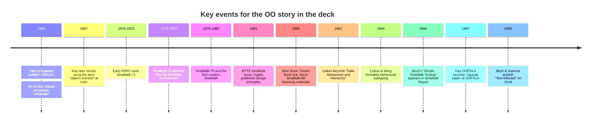

# Object Orientation in Modern C++ Fact Check and Citation Verification

## Executive summary

The deck is historically strong, but four points need tightening before you give it as a C++Now talk. First, the Alan Kay quotations need more careful sourcing and, in one case, a wording correction: the accessible OOPSLA 1997 transcript says Kay “made up” the term object-oriented and “did not have C++ in mind,” not “invented” in that exact line. Second, the core Smalltalk size claim is directionally plausible but not firmly supported in primary sources as “under 50,000 lines”; the strongest primary numbers I found are Xerox’s 1983 description of a **600 KB virtual image**, **about 15,000 objects**, and **over 1 million bytes of commented source text on-line**. Third, the **~12K lines of C++17 VM** claim is not publicly verifiable from the sources I could inspect; if that is your project, it should be presented as a personal measurement tied to your own repository/commit, not as a generally sourced historical fact. Fourth, the Liskov material should distinguish between the **1987 keynote** where the idea appears, the **1994 TOPLAS paper** where behavioral subtyping is formalized, and the **1996 Robert C. Martin article** that popularized the short slogan and the “LSP” label. citeturn36view0turn34view0turn11view0turn24view0turn22search2turn27search0

The safest historical framing for the talk is: **Simula gave C++ its class-and-hierarchy lineage; Smalltalk reshaped OO around messaging, local state, late binding, and a live integrated system**. That claim is well supported by Dahl and Nygaard’s Simula work, Stroustrup’s own account of C++’s design goals, Ingalls’s 1981 Smalltalk principles paper, and Kay’s later reflections. citeturn20search4turn19search22turn19search0turn9view1turn34view0turn6view1

The single biggest recommendation for the deck is to replace exact-but-weakly-sourced quantitative claims with **stronger primary-source claims**. For example, instead of “the whole Smalltalk-80 source was under 50,000 lines,” say that **Xerox described the released system as a 600 KB virtual image with about 15,000 objects and over 1 MB of commented source text available on-line**. That is both more defensible and more impressive. citeturn11view0

## Historical and quotation claims that are ready to use

### Alan Kay on what OO meant to him

**Verification result:** Confirmed, but the deck should distinguish among three different Kay sources that do different jobs.

The highest-confidence Kay source for your thesis is actually not the slogan “the big idea is messaging,” but Kay’s 1993 HOPL paper. There he writes that Smalltalk’s design came from treating everything as a single behavioral building block and that “each Smalltalk object is a recursion on the entire possibilities of the computer.” That is the strongest primary-text way to anchor your argument that OO was not originally about inheritance-first taxonomies. citeturn34view0

For the explicit “definition” style quote, the best accessible source is Kay’s preserved 2003 email to Stefan Ram. The exact wording is: “OOP to me means only messaging, local retention and protection and hiding of state-process, and extreme late-binding of all things.” This is not a peer-reviewed publication, but it is a first-person source and far more specific than most paraphrases. citeturn6view1

The well-known anti-C++ line is also supported, but with a wording caveat. In the accessible transcript of Kay’s OOPSLA 1997 keynote, the line appears as: “actually, I made up the term object-oriented, and I can tell you I did not have C++ in mind.” The conference and the keynote title are also independently confirmed. Because the surviving accessible source is a transcript in the Viewpoints Intelligent Archive rather than an official ACM transcript, I would treat this as **confirmed, with transcript provenance noted**. citeturn36view0turn35search1

The “big idea is messaging” line is also very likely authentic, but the source trail is weaker than the 1993 and 2003 texts. The accessible version is a preserved copy of a 1998 Squeak mailing-list post quoting the original Squeak archive URL. Since the original list page is not the accessible page here, I would classify this as **partially confirmed** and use it only alongside the stronger 1993/2003 sources. citeturn37view0turn6view2

**Recommended slide-text correction:**  
Use this wording instead of the current compound paraphrase:  
**“Alan Kay’s own formulation emphasized messaging, local state protection, and extreme late binding; his later complaint was that people focused on classes instead of the message architecture.”** citeturn6view1turn37view0turn34view0

**Preferred short direct quotes for slides**
- “OOP to me means only messaging…” citeturn6view1
- “each Smalltalk object is a recursion on the entire possibilities of the computer.” citeturn34view0
- “I made up the term object-oriented … I did not have C++ in mind.” citeturn36view0

**Corrected BibTeX**
```bibtex
@article{Kay1993EarlyHistory,
  author  = {Alan C. Kay},
  title   = {The Early History of Smalltalk},
  journal = {ACM SIGPLAN Notices},
  volume  = {28},
  number  = {3},
  pages   = {69--95},
  year    = {1993},
  month   = mar,
  doi     = {10.1145/155360.155364},
  url     = {https://doi.org/10.1145/155360.155364}
}
```

```bibtex
@misc{Kay2003Clarification,
  author       = {Alan Kay},
  title        = {Clarification of ``object-oriented''},
  howpublished = {Email to Stefan Ram, preserved copy},
  year         = {2003},
  month        = jul,
  day          = {23},
  note         = {Accessible preserved copy of first-person email},
  url          = {https://gist.github.com/nirrek/f46fdf1c1ecc0102ef07}
}
```

```bibtex
@misc{Kay1997OOPSLAKeynoteTranscript,
  author       = {Alan Kay},
  title        = {The Computer Revolution Has Not Happened Yet},
  howpublished = {OOPSLA '97 keynote, accessible transcript in the Viewpoints Intelligent Archive},
  year         = {1997},
  note         = {Transcript source is archival, not an official ACM transcript},
  url          = {https://tinlizzie.org/IA/index.php/Alan_Kay_at_OOPSLA_1997%3A_The_Computer_Revolution_has_not_Happened_Yet}
}
```

### Dan Ingalls on message send, modularity, and system shape

**Verification result:** Confirmed.

Ingalls’s 1981 Byte paper is one of the strongest primary sources in your whole deck. It explicitly states: “Computing should be viewed as an intrinsic capability of objects that can be uniformly invoked by sending messages.” It also argues that message sending provides modularity by decoupling the intent of a message from the method used by the receiver, and it presents Smalltalk as a **uniform metaphor** rather than an accumulation of features. citeturn9view1turn8view3

That same paper also supports the “Smalltalk system composition” story. Ingalls argues that Smalltalk should not have an external “operating system” in the traditional sense and then describes storage management, files, display handling, input devices, subsystem access, and the debugger as things naturally incorporated into the language model. This directly supports your slide theme that compiler/debugger/UI/system services were not separate conceptual strata bolted onto the language. citeturn9view2

The Xerox Smalltalk-80 system material from 1982–1983 strengthens this. Xerox describes the environment as combining a compiler, decompiler, debugger, editor, browsing/viewing tools, and UI into an integrated, modeless runtime environment; it also says the virtual image is written entirely in Smalltalk-80. citeturn11view0

**Recommended slide-text correction:**  
**“Ingalls’s 1981 formulation of Smalltalk put messaging and uniformity at the center: objects encapsulate state, and computation is invoked by sending messages.”** citeturn9view1turn8view3

**Corrected BibTeX**
```bibtex
@article{Ingalls1981DesignPrinciples,
  author  = {Daniel H. H. Ingalls},
  title   = {Design Principles Behind Smalltalk},
  journal = {BYTE},
  volume  = {6},
  number  = {8},
  pages   = {286--298},
  year    = {1981},
  month   = aug,
  url     = {https://gwern.net/doc/cs/1981-ingalls.pdf}
}
```

```bibtex
@manual{Xerox1983Smalltalk80System,
  author       = {{Xerox Corporation}},
  title        = {The Smalltalk-80 System},
  year         = {1983},
  note         = {Product/system description and licensing packet},
  url          = {https://archive.computerhistory.org/resources/access/text/2024/02/102805419-05-01-acc.pdf}
}
```

### Simula’s lineage and how it differs from Smalltalk

**Verification result:** Confirmed for the lineage; partially confirmed for strong comparative judgments.

Dahl and Nygaard are the accepted authors of Simula, and the 1966 CACM paper defines it as an ALGOL-based language for describing discrete event systems, with quasi-parallel processing central to the design. That supports the “simulation focus” claim cleanly. citeturn20search4

For the difference in model, Kay’s own later reflections are the best source. In his 2003 email he says he disliked the built-in inheritance model of Simula I/67 and originally left inheritance out until he understood it better. In the 1997 OOPSLA keynote transcript he says Simula “came out of the world of data structures and procedures,” even though it made state/procedure relationships more useful. That is exactly the nuance you want when contrasting Simula’s influence with Smalltalk’s message-centered reframing. citeturn6view1turn36view0

For C++, Stroustrup is explicit: C++ was designed to provide “Simula’s facilities for program organization” with C’s efficiency and flexibility, and he says C++ borrowed from Simula the ideas of classes and class hierarchies. That is the cleanest possible source for the “C++ inherits its class model from Simula” claim. citeturn19search22turn19search0turn19search3

What is **not** firmly sourceable as a historical fact is the stronger rhetorical claim that “the use of OO in C++ tends to be more like Smalltalk, Java, and other OO languages.” That is a plausible interpretive statement about mainstream usage, but it is not something I would present as a settled historical claim without recasting it as your observation. citeturn19search0turn19search1

**Recommended slide-text correction:**  
**“C++ inherits classes and class hierarchies primarily from Simula; Smalltalk pushed OO further toward messaging, local state, and a live integrated environment.”** citeturn19search22turn20search4turn6view1turn11view0

**Corrected BibTeX**
```bibtex
@article{DahlNygaard1966Simula,
  author  = {Ole-Johan Dahl and Kristen Nygaard},
  title   = {SIMULA: An ALGOL-Based Simulation Language},
  journal = {Communications of the ACM},
  volume  = {9},
  number  = {9},
  pages   = {671--678},
  year    = {1966},
  month   = sep,
  doi     = {10.1145/365813.365819},
  url     = {https://doi.org/10.1145/365813.365819}
}
```

```bibtex
@article{Stroustrup1993History,
  author  = {Bjarne Stroustrup},
  title   = {A History of C++: 1979--1991},
  journal = {ACM SIGPLAN Notices},
  volume  = {28},
  number  = {3},
  pages   = {271--297},
  year    = {1993},
  month   = mar,
  doi     = {10.1145/155360.155375},
  url     = {https://stroustrup.com/hopl2.pdf}
}
```

### Liskov, Wing, behavioral subtyping, and the LSP name

**Verification result:** Confirmed, with a citation split you should make explicit.

Barbara Liskov’s keynote **“Data Abstraction and Hierarchy”** is the right citation for the origin of the substitutability idea in OO design. The accessible ACM metadata page is for the SIGPLAN Notices reprint, while Researchr/DBLP point to the original OOPSLA 1987 addendum proceedings. Both are real; the latter is the better “first appearance” citation. The paper’s message is also exactly aligned with your deck’s inheritance skepticism: data abstraction is the more important idea, and hierarchy is only sometimes useful. citeturn24view0turn24view1turn23search5turn23search19

The formal statement of behavioral subtyping belongs to the 1994 TOPLAS paper by Liskov and Wing. That is the source for the “Subtype Requirement” formulation and for the more rigorous behavioral account that considers aliasing/history constraints. citeturn22search2turn22search4turn22search34

If you use the short slogan **“Subtypes must be substitutable for their base types,”** that is best attributed to Robert C. Martin’s 1996 **C++ Report** article, not to Liskov’s original wording. In other words: **Liskov for the underlying principle, Liskov and Wing for the formalization, Martin for the slogan and popular packaging.** citeturn27search0turn22search2turn24view1

**Recommended slide-text correction:**  
**“Use ‘Liskov 1987’ for the design principle, ‘Liskov & Wing 1994’ for formal behavioral subtyping, and Robert C. Martin 1996 if you want the compact ‘base types’ slogan.”** citeturn24view1turn22search2turn27search0

**Corrected BibTeX**
```bibtex
@inproceedings{Liskov1987DataAbstraction,
  author    = {Barbara Liskov},
  title     = {Keynote Address: Data Abstraction and Hierarchy},
  booktitle = {Addendum to the Proceedings on Object-Oriented Programming Systems, Languages and Applications (OOPSLA '87)},
  pages     = {17--34},
  year      = {1987},
  publisher = {ACM},
  address   = {New York, NY, USA},
  doi       = {10.1145/62138.62141},
  url       = {https://doi.org/10.1145/62138.62141}
}
```

```bibtex
@article{LiskovWing1994Behavioral,
  author  = {Barbara H. Liskov and Jeannette M. Wing},
  title   = {A Behavioral Notion of Subtyping},
  journal = {ACM Transactions on Programming Languages and Systems},
  volume  = {16},
  number  = {6},
  pages   = {1811--1841},
  year    = {1994},
  month   = nov,
  doi     = {10.1145/197320.197383},
  url     = {https://doi.org/10.1145/197320.197383}
}
```

```bibtex
@article{Martin1996LSP,
  author  = {Robert C. Martin},
  title   = {The Liskov Substitution Principle},
  journal = {C++ Report},
  volume  = {8},
  number  = {3},
  pages   = {14,16--17,20--23},
  year    = {1996},
  month   = mar
}
```

### SUnit, JUnit, and xUnit lineage

**Verification result:** Confirmed.

Kent Beck’s Smalltalk testing framework is clearly the ancestor. The accessible Cambridge reprint of **“Simple Smalltalk Testing”** identifies the article and its original **Smalltalk Report, October 1994** publication context. GNU Smalltalk documentation also directly states that SUnit originated with Kent Beck and describes it as excerpted from his paper. citeturn28search2turn28search0

On the JUnit side, the official JUnit FAQ says JUnit was originally written by **Erich Gamma and Kent Beck**, and the project information pages say the same. The Beck/Gamma article **“Test-Infected: Programmers Love Writing Tests”** is the canonical early JUnit paper and is easily citable via the Cambridge reprint. This is sufficient to support an SUnit → JUnit → xUnit evolutionary line on your slides. citeturn30search0turn30search1turn30search2turn31search1

**Recommended slide-text correction:**  
**“SUnit is Kent Beck’s Smalltalk testing framework; JUnit is Beck and Gamma’s Java adaptation, and the xUnit family follows from that lineage.”** citeturn28search2turn30search0turn31search1

**Corrected BibTeX**
```bibtex
@incollection{Beck1997SimpleSmalltalkTesting,
  author    = {Kent Beck},
  title     = {Simple Smalltalk Testing},
  booktitle = {Kent Beck's Guide to Better Smalltalk: A Sorted Collection},
  publisher = {Cambridge University Press},
  year      = {1997},
  pages     = {277--288},
  doi       = {10.1017/CBO9780511574979.033},
  url       = {https://doi.org/10.1017/CBO9780511574979.033},
  note      = {Reprint of ``Smalltalk Report'', October 1994}
}
```

```bibtex
@incollection{BeckGamma2000TestInfected,
  author    = {Kent Beck and Erich Gamma},
  title     = {Test-Infected: Programmers Love Writing Tests},
  booktitle = {More Java Gems},
  publisher = {Cambridge University Press},
  year      = {2000},
  pages     = {357--376},
  doi       = {10.1017/CBO9780511550881.029},
  url       = {https://doi.org/10.1017/CBO9780511550881.029}
}
```

## Quantitative claims and system-composition claims

### Claimed numbers versus sourced numbers

| Deck claim | Best-supported sourced number | Assessment |
|---|---:|---|
| “Smalltalk-80 source was under 50,000 lines of Smalltalk” | Xerox says **~15,000 objects** in a **600 KB virtual image** and **over 1 million bytes of commented source text on-line** | Exact 50K LOC is **not confirmed** from primary sources |
| “A VM reimplementation was ~12K lines of C++17” | No public primary/public repo source found for this specific figure | **Unsupported in public sources** unless tied to your own repo/commit |
| “The system included compiler/debugger/UI in the language environment” | Xerox brochure explicitly lists compiler, decompiler, debugger, text editor, browser/viewing tools, UI integration; Ingalls explains file system, display, input, debugger as Smalltalk subsystems | **Confirmed** |
| “Early Apple Smalltalk-80 interpreter was compact by modern standards” | Squeak paper says Apple Smalltalk-80 interpreter was **120 pages of sparsely commented 68020 assembly** | **Confirmed** |

The first row is the main risk. The primary Xerox material is excellent, but it does **not** give you the comforting exactness of “under 50,000 lines.” What it gives you is arguably better for a historical slide: a whole live environment written in Smalltalk-80, around 15,000 objects in the image, and over one megabyte of source text on-line. That is concrete, primary, and memorable. A later secondary reconstruction repository confirms that a 1983 Smalltalk-80 source tree exists and is not enormous, but it still does not rescue the exact “50,000 lines” formulation. citeturn11view0turn13view0

The second row is the weakest claim in the deck as currently phrased. I found public C++-based Smalltalk-80 reimplementation projects, and one modern “written in itself” Smalltalk-80 VM project that explicitly credits a C++ VM as helpful background, but I did **not** find a public, authoritative source for **your** claimed ~12K C++17 VM size. If the claim is about your own implementation, frame it in the first person and, ideally, cite your own repository/commit or measured KLOC script. Without that, it reads as a sourced historical fact when it is really a personal project metric. citeturn15search4turn17search2turn13view1

The system-composition claims are in much better shape. Xerox explicitly says the system combines a compiler, decompiler, debugger, editor, viewing support, and UI into a single integrated environment, and that the virtual image is written entirely in Smalltalk-80. Ingalls independently reinforces that storage, files, display, keyboard input, subsystems, and debugging were folded into the object/message model rather than treated as an alien operating-system layer. citeturn11view0turn9view2

**Recommended slide-text correction for the size slide:**  
**“The released Smalltalk-80 system was tiny by modern standards: Xerox described a 600 KB virtual image with about 15,000 objects and over 1 MB of commented source text available on-line.”** citeturn11view0

**If you want to keep the 12K personal VM claim:**  
**“In my own recent reimplementation, the VM core came in at roughly 12 KLOC of C++17.”**  
That wording is fine **only if you add your own repository/commit or a speaker-note footnote explaining the measurement basis.** The public sources I reviewed do not verify it. citeturn15search4turn17search2

## Timeline and framing you can safely use on stage



This timeline is consistent with Kay’s own 1993 retrospective, the Simula primary literature, Ingalls’s 1981 Byte paper, Xerox’s 1983 system materials, the Liskov papers, and the Beck/Gamma testing lineage. The major nuance worth speaking aloud is that **“Smalltalk-80” names the release generation, but the public story stretches across 1981 exposure and 1983 licensing/book publication**. Likewise, **Simula belongs to the 1960s simulation/program-organization lineage, while Smalltalk turns that lineage into a message-centered, fully live system model**. citeturn34view0turn20search4turn9view1turn11view0turn24view1turn22search2turn28search2turn31search1

## Slide-level recommendations for the current deck

The safest way to sharpen the Smalltalk section is to lead with **Kay 1993 + Ingalls 1981**, then use the later Kay quotes as commentary rather than as sole evidence. In practice, that means you can say:

“Smalltalk’s model was not inheritance-first. Kay framed it as a world of behavioral building blocks; Ingalls framed computation as message send; and Xerox shipped the result as a live environment whose tools were themselves part of the object world.” citeturn34view0turn9view1turn11view0

When you pivot to C++, the strongest historically precise phrasing is:

“C++ took classes and class hierarchies from the Simula tradition, but most conversations about ‘OO’ in industry are shaped by the Smalltalk-era emphasis on interface boundaries, substitutability, and dynamic system behavior.” The first half is directly sourced; the second half is best presented as an interpretive framing rather than a claim of historical transmission. citeturn19search22turn19search3turn20search4turn24view0

For the Liskov section, do not cite only “LSP” and move on. A better C++Now-grade phrasing is:

“Liskov’s 1987 point was that data abstraction matters more than hierarchy; Liskov and Wing’s 1994 point was that subtype relations must preserve provable properties. That is the inheritance warning sign modern C++ programmers actually need.” citeturn24view1turn22search2

For the testing lineage slide, the historical point is strong and memorable:

“SUnit shows Smalltalk’s live object environment begetting a testing framework; JUnit is the Java adaptation by Beck and Gamma; xUnit is the family tree.” citeturn28search2turn30search0turn31search1

## Open questions and limitations

I did **not** inspect your actual `.bib` file, so the BibTeX corrections above target the canonical records most likely to correspond to the sources already in the deck rather than diffing against your local entries. Where ACM proceedings and SIGPLAN reprints both exist, I have called out the distinction explicitly. citeturn24view0turn24view1turn23search5

I could not verify the exact **“under 50,000 lines”** figure for the original Smalltalk-80 system from a primary source, and I could not verify the exact **“~12K lines of C++17”** figure for your VM from a public source. Those are the two claims most likely to attract a skeptical audience question. If you keep them, the safest path is to soften the first to “tens of thousands of lines” or replace it with Xerox’s 1983 object/byte figures, and to make the second clearly personal and citeable from your own project materials. citeturn11view0turn13view0turn15search4turn17search2

The 1998 “big idea is messaging” slogan is probably genuine, but the accessible evidence here is a preservation page quoting the original mailing-list URL rather than the original list page itself. For a talk where you want to minimize citation risk, the stronger move is to rely on Kay’s 1993 HOPL paper and 2003 email instead. citeturn37view0turn34view0turn6view1