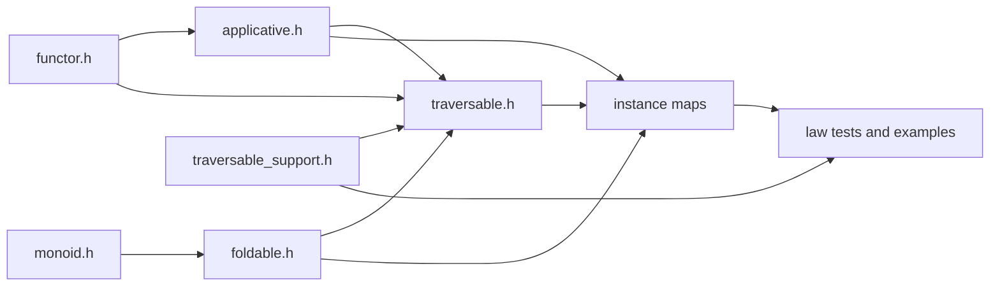
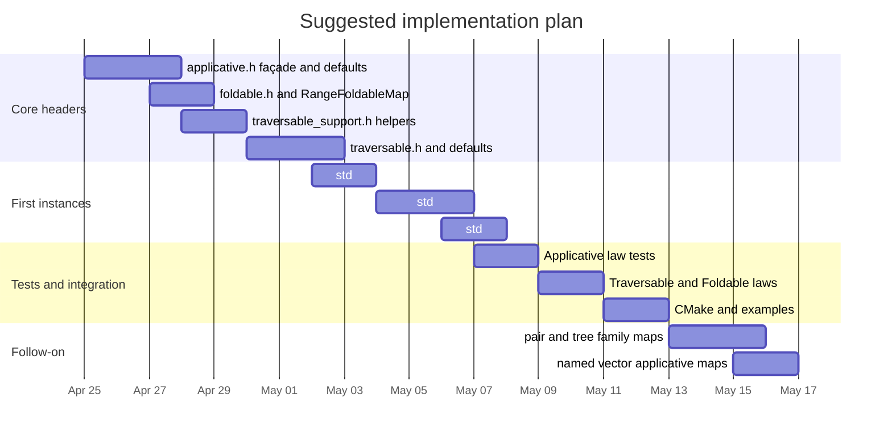

# Implementing Foldable Traversable and Applicative in concept_map Style

## Executive summary

This report recommends extending `concept_map` by preserving its current **façade-plus-concept-map** style and adding three new interfaces: `Foldable` as **`fold_map`-first**, `Traversable` as **`traverse`-first**, and `Applicative` as a **public invoke-first façade** backed by internal `pure` and either `ap` or `liftA2`. That direction fits both the existing repository and the primary sources. The current repo already uses façade templates plus `inline constexpr` variable-template dispatch for `Functor` and `Monoid`; McBride and Paterson frame Applicative computation as a pure function applied to a fixed sequence of effectful arguments; Hackage defines `Foldable` and `Traversable` in a way that makes `foldMap`, `Identity`, and `Const` the natural defaults; and the iterator/traversal papers explain why traversal should be the abstraction that combines mapping and accumulation while preserving shape. citeturn2view0turn2view1turn4view4turn4view5turn4view2turn4view3

The highest-confidence design recommendation is a **hybrid dispatch model**: keep `*_concept_map<C>` as the primary visible customization point because that matches the repo, but allow an internal family-tag layer for template families such as `std::array<T, N>` and one-hole product families such as `std::pair<M, T>`. At the same time, do **not** define a default Applicative for `std::vector<T>`; expose named policy maps instead, because the literature shows that list-like containers admit multiple lawful applicative structures with materially different semantics, notably Cartesian-product and zip-style behavior. `Foldable` can safely be broader than `Traversable`; a blanket range-based `Foldable` is reasonable, but a blanket `RangeTraversableMap` is not, because lawful traversables are tied to shape preservation and, via the representation theorem, to finitary container structure. citeturn2view0turn7view3turn12view5turn10view0turn14view2

The main assumptions and unspecified items should be made explicit to any successor LLM. Assume **C++20** unless told otherwise, but note that the current repo already uses **C++23-leaning idioms** such as explicit-object-parameter syntax (`this auto&&`) and `std::ranges::fold_right`, the latter of which is a C++23 ranges fold algorithm. Assume **Catch2** unless told otherwise, but note that the current repo’s CMake currently wires tests through **GoogleTest**. Follow the current repo layout conventions under `src/smd/conceptmap/` and `*.t.cpp` test files. citeturn2view0turn2view1turn2view2turn17view1

## Assumptions and source baseline

The design target is not “generic Haskell-in-C++,” but “Haskell-like interfaces implemented in the **existing concept-map idiom**.” In `concept_map`, `Functor` is a façade `Functor<Impl, C>` that forwards `map`, derives `replace`, and dispatches through `functor_concept_map<C>`; `Monoid` uses the same pattern and already provides the algebraic substrate that `fold_map` wants. The tests also show that generic functions default to these map objects and can be overridden explicitly. That existing idiom should stay intact because it is the strongest source of consistency for future code and tests. citeturn2view0turn2view1turn2view3turn2view4

Theoretical constraints matter here because the requested interfaces are only valuable if they are **lawful**. McBride and Paterson define Applicative as a weaker-than-Monad interface for effectful programming and explicitly normalize applicative programs to the form “`pure f` applied to effectful arguments”; Hackage then codifies the minimal complete definition and laws. Gibbons and Oliveira argue that applicative traversal captures the essence of the iterator pattern because it supports both mapping and accumulation, while Bird et al. show that traversable functors correspond to finitary containers and can be characterized in terms of shape and contents. These are not abstract niceties: they directly constrain which C++ types should receive default instances and which should require named policies. citeturn4view4turn4view0turn10view7turn10view6turn10view0turn10view1

The extra repository you supplied, `fringetree`, is relevant mainly as a **future concrete tree target**, not as a source of typeclass interfaces. The repo describes itself as an intentionally suboptimal persistent functional binary tree, and its header already exposes tree structure, `flatten`, `concat`, `measure`, and a tagged-node design. That makes it a plausible follow-on target for `Foldable` and `Traversable` experiments, especially because its `tag`/`measure` story is overtly monoidal, but it should come **after** `std::optional` and `std::array` in implementation order. citeturn9view0turn6view1turn6view2



The module graph above is the minimal extension consistent with both the repo and the Haskell hierarchy: `Applicative` refines `Functor`; `Traversable` interacts with both `Functor` and `Foldable`; and support types such as `Identity`, `Const`, `Compose`, `Endo`, and `Dual` belong in a shared support header rather than being reimplemented ad hoc in tests. citeturn2view0turn2view1turn4view2turn4view3turn11view1

## Minimal interfaces and public API

For **Applicative**, the public API should be built around **invoke-first usage**, because that is the direct C++ analogue of the canonical applicative form from the paper. Users should write something morally like `invoke(app, f, fa, fb, fc...)`, where `f` is a pure callable and `fa`, `fb`, `fc` are values already in the applicative context. Internally, however, the implementation contract should still preserve the Haskell shape: each map must provide `pure`, and at least one of `ap` or `liftA2`; if both `ap` and `liftA2` are present, they should agree with the defaults. Hackage is explicit that the minimal complete definition is `pure` and either `<*>` or `liftA2`, and it further notes that specialized `liftA2` implementations can be more efficient than the default expressed via `fmap` and `<*>`. citeturn4view0turn5view9turn4view4

For **Foldable**, the primitive should be `fold_map`, not `foldr`, even though Hackage allows either `foldMap` or `foldr` as the formal minimal definition. In this repository, `fold_map` is the better primitive because it composes directly with the already-existing `Monoid` concept maps, and Hackage’s laws characterize `foldr`, `foldl`, and `fold` in terms of `foldMap`, `Endo`, and `Dual`. This also best matches the existing `Monoid` façade, which already derives `concat` and `identity` in the same “small primitive, broader defaults” style. citeturn5view10turn11view1turn2view1

For **Traversable**, the primitive should be `traverse`, and it should take an **explicit applicative map parameter** in C++:

```cpp
template<class TravMap, class AppMap, class C, class F>
constexpr auto traverse(TravMap const& tr, AppMap const& app, C&& c, F&& f);
```

That explicit applicative parameter is the cleanest way to handle **empty traversals** and alternative applicative policies in C++. Hackage recommends implementing `traverse` explicitly rather than relying on `sequenceA . fmap`; it also defines `sequenceA = traverse id` and warns about recursion pitfalls when pairing defaults with `fmapDefault`. In C++, the explicit `app` argument keeps the instance selection visible and prevents ambiguity when an empty structure forces the traversal to construct `pure empty` without any element values to drive inference. citeturn12view2turn12view3turn13view0

The public API should lean on **`std::invocable`**, **`std::invoke`**, and **`std::apply`**. `std::invocable` is defined directly in terms of `std::invoke`; `std::invoke` handles free functions, lambdas, function objects, member functions, and data members; and `std::apply` calls a callable with arguments packed into a tuple-like object, including `std::pair` and `std::array`. That makes them an excellent fit for an invoke-first applicative façade and for a tuple-accumulation fallback implementation of variadic invocation. `regular_invocable` is probably too strong for the public customization boundary, because it adds semantic non-modification and equality-preservation requirements that many lawful callables need not advertise through concepts. citeturn15view1turn15view0turn15view2turn15view3

A successor LLM should therefore target a public surface along these lines:

```cpp
template<class C> inline constexpr auto applicative_concept_map = /* ... */;
template<class C> inline constexpr auto foldable_concept_map    = /* ... */;
template<class C> inline constexpr auto traversable_concept_map = /* ... */;

template<class AppMap, class F, class... As>
  requires std::invocable<F&, /* extracted value types... */>
constexpr auto invoke(AppMap const& app, F&& f, As&&... as);

template<class FoldMap, class MonoidMap, class C, class F>
constexpr auto fold_map(FoldMap const& fm, MonoidMap const& mm, C&& c, F&& f);

template<class TravMap, class AppMap, class C, class F>
constexpr auto traverse(TravMap const& tr, AppMap const& app, C&& c, F&& f);
```

That shape is faithful to the repo’s current concept-map style, faithful to Hackage’s minimal contracts, and natural in modern C++. citeturn2view0turn2view1turn4view0turn4view2

## Dispatch and variadic implementation

The best dispatch strategy is **hybrid**: concrete-type concept maps first, family tags underneath when a family-level implementation is cleaner, and named map objects when a single representation admits multiple lawful policies. This preserves the repo’s current style while avoiding duplication and accidental overclaiming. `std::optional<T>` is a good concrete-type default. `std::array<T, N>` and `std::pair<M, T>` are good family-level targets. `std::vector<T>` should not get a default Applicative at all; it should expose named maps such as `vector_cartesian_applicative_map` and `vector_zip_applicative_map`, because the literature makes clear that list-like structures support multiple lawful applicatives with different sequencing behavior. citeturn2view0turn7view3turn14view1turn14view2

| Decision area | Option | Strengths | Weaknesses | Recommendation |
|---|---|---|---|---|
| Dispatch | Concrete-type `*_concept_map<C>` | Matches repo exactly; best for canonical defaults like `std::optional<T>` | Repeats logic across families | Use as the visible API |
| Dispatch | Family-tag dispatch | Good for `std::array`, `std::pair`, allocator-aware `std::vector` families | Less obviously aligned with current repo if used alone | Use internally under concrete maps |
| Dispatch | Named policy maps | Honest about ambiguity, especially for `std::vector` Applicative and alternate tree orders | More verbose at call sites | Use whenever semantics are not canonical |
| Variadic invoke | Repeated `ap` recursion | Closest to Haskell surface form | Awkward n-ary C++; may miss specialization opportunities | Keep as a derivation path |
| Variadic invoke | Repeated `liftA2` recursion | Simple binary structure; easy to specialize | Still awkward for higher arity | Acceptable secondary fallback |
| Variadic invoke | Tuple accumulation + `liftA2` + `std::apply` | Best match for invoke-first API; leverages `std::apply` and `std::invoke` | Intermediate tuples and `tuple_cat` can cost | Preferred generic fallback |
| Applicative for `std::vector` | Default cartesian | Lawful and familiar from ordinary lists | Competes with zip expectations | Do not make default |
| Applicative for `std::vector` | Default zip | Intuitive to some users | Semantics differ fundamentally from cartesian; can mislead | Do not make default |
| Applicative for `std::vector` | Named cartesian and named zip | Explicit, testable, honest | Slightly more ceremony | Preferred |

The preferred variadic implementation strategy is **tuple accumulation plus `liftA2` plus `std::apply`**. The idea is to accumulate the extracted pure arguments inside the applicative context as a tuple, then apply the pure callable once at the end. This works especially well in C++ because `std::apply` already treats `std::pair` and `std::array` as tuple-like, and `std::invoke` already handles the broad callable space. Hackage’s documentation provides the efficiency rationale for keeping `liftA2` as an optimization hook, and the Applicative paper provides the semantic rationale for thinking of the computation as a pure function plus effectful arguments. citeturn15view2turn15view0turn5view9turn4view4

A concise fallback sketch is:

```cpp
template<class App, class F, class... AXs>
auto invoke(App const& app, F&& f, AXs&&... axs) {
    auto acc = app.pure(std::tuple<>{});

    auto push = []<class Tup, class X>(Tup&& tup, X&& x) {
        return std::tuple_cat(
            std::forward<Tup>(tup),
            std::tuple<std::decay_t<X>>(std::forward<X>(x)));
    };

    ((acc = app.liftA2(push, std::move(acc), std::forward<AXs>(axs))), ...);

    return app.map(
        std::move(acc),
        [fn = std::forward<F>(f)](auto&& tup) mutable -> decltype(auto) {
            return std::apply(
                [&fn](auto&&... xs) -> decltype(auto) {
                    return std::invoke(fn, std::forward<decltype(xs)>(xs)...);
                },
                std::forward<decltype(tup)>(tup));
        });
}
```

This should be the **generic fallback**, not the only implementation. `std::optional` and `std::array` can often do better with direct specializations; the generic path should be there for correctness and coverage, while concrete instance maps remain free to override `invoke`, `ap`, or `liftA2` for performance. citeturn15view0turn15view2turn5view9

## Foldable Traversable and lawfulness

`Foldable` should be **monoid-first**. The core operation is `fold_map(f)`, parameterized by a monoid map; `fold` is then `fold_map(identity)`, and `foldr`/`foldl` can be derived using `Endo` and `Dual`, exactly as Hackage states. This is a particularly strong fit for your repository because `Monoid` already exists and already follows the same “primitive plus defaults” style. A blanket `RangeFoldableMap` is reasonable because `Foldable` does not require `Functor`, and Hackage explicitly points out that structures like `Set` can be `Foldable` without being `Functor`. In C++, prefer a one-pass eager `fold_map` for ranges; derive `foldr` and `foldl` only when needed, and do not promise Haskell-like laziness for arbitrary ranges. citeturn11view1turn5view12turn2view1turn4view1

That last point matters. Hackage notes that `foldr` can produce terminating expressions from unbounded lists when the operator is lazy in its right argument, whereas strict left folds consume the whole structure and `foldMap'` is the appropriate strict reduction when you need eager accumulation. Generic C++ folds over ranges are normally **eager**, and the repo already uses `std::ranges::fold_right`, which is a C++23 algorithm. So the right C++ story is: `Foldable` laws should match Hackage, but performance/termination behavior should be documented in C++ terms, with early termination or short-circuiting exposed through specialized algorithms rather than by overpromising on a generic `foldr`. citeturn11view0turn4view1turn17view1

`Traversable` should be **`traverse`-first**, with `fmapDefault` and `foldMapDefault` derived through `Identity` and `Const`. Hackage states those defaults explicitly and warns that defining `Traversable` only through `sequenceA` can interact badly with `fmapDefault`; the iterator paper explains why the constant applicative is the right tool for extracting accumulation from traversal; and Hackage’s laws specify naturality, identity, composition, and the purity corollary `traverse pure = pure`. Those laws should be the center of the C++ design, because they are what allow the rest of the concept maps to compose predictably. citeturn12view3turn13view0turn10view6

The representation theorem is the clearest reason **not** to add a blanket `RangeTraversableMap`. Bird et al. characterize traversable functors as finitary containers and describe traversable data in terms of **shape and contents**; Hackage likewise says that traversal constructs outputs of the **same shape** as the input and explains that a traversable structure can be decomposed into a spine and an element list from which the original can be reconstructed. That is a much stronger requirement than “can be iterated.” `std::optional`, `std::array`, `std::vector`, one-hole products, and concrete trees fit this story. Generic views, generators, and many borrowed ranges do not. citeturn10view0turn10view1turn14view2turn12view3

Traversal order is also a policy, not an implementation accident. Hackage shows one binary tree supporting in-order, pre-order, and post-order traversals via wrappers, and the iterator paper shows a `Backwards` applicative adapter that reverses effect order while preserving applicative structure. The practical C++ implication is: a tree should expose **one canonical default traversable map** plus separately named alternatives for changed order, rather than silently conflating multiple lawful traversals into one default instance. That same rule argues for named applicative maps when you want `std::vector` zip semantics or reversed effect order. citeturn13view1turn10view8

## Instances testing and repository plan

The recommended initial instance set is conservative. Give `std::optional<T>` canonical defaults for `Applicative`, `Foldable`, and `Traversable`. Give `std::array<T, N>` canonical defaults as a **pointwise** applicative/traversable/foldable family; Hackage’s `Vec2` and `Vec3` examples are a direct analogue, with `pure` replicating the value and `liftA2` combining componentwise. Give `std::vector<T, A>` default `Foldable` and probably default `Traversable` only through a dedicated family map that can rebuild with `allocator_traits<Alloc>::rebind_alloc<U>` when the element type changes; do **not** give it a default Applicative. Give `std::pair<M, T>` a traversable one-hole family over the second component, and an Applicative only when the left component has a monoid map, matching Hackage’s `Monoid a => Applicative ((,) a)`. Trees should come later, ideally using a named map policy for traversal order; your `fringetree` repo is a plausible later target because it already exposes tree structure, `measure`, and concatenation. citeturn5view6turn12view4turn17view0turn14view1turn14view2turn6view1turn9view0

A concise code sketch for `std::optional` in C++20-compatible style is:

```cpp
template<class T>
struct OptionalApplicativeMap {
    template<class U>
    constexpr auto pure(U&& u) const
        -> std::optional<std::decay_t<U>> {
        return std::optional<std::decay_t<U>>(std::forward<U>(u));
    }

    template<class FF, class FX>
    constexpr auto ap(FF const& ff, FX const& fx) const
        -> std::optional<std::invoke_result_t<
            typename FF::value_type const&, typename FX::value_type const&>> {
        if (!ff || !fx) return std::nullopt;
        return std::invoke(*ff, *fx);
    }

    template<class F, class X, class Y>
    constexpr auto liftA2(F&& f,
                          std::optional<X> const& x,
                          std::optional<Y> const& y) const
        -> std::optional<std::invoke_result_t<F&, X const&, Y const&>> {
        if (!x || !y) return std::nullopt;
        return std::invoke(std::forward<F>(f), *x, *y);
    }
};
```

For `std::array<T, N>`, the intended policy is pointwise rather than cartesian, mirroring Hackage’s fixed-width vector examples:

```cpp
template<class T, std::size_t N>
struct ArrayApplicativeMap {
    template<class U>
    constexpr auto pure(U const& u) const -> std::array<U, N> {
        std::array<U, N> out{};
        out.fill(u);
        return out;
    }

    template<class F, class X, class Y>
    constexpr auto liftA2(F&& f,
                          std::array<X, N> const& xs,
                          std::array<Y, N> const& ys) const
        -> std::array<std::invoke_result_t<F&, X const&, Y const&>, N> {
        std::array<std::invoke_result_t<F&, X const&, Y const&>, N> out{};
        for (std::size_t i = 0; i < N; ++i)
            out[i] = std::invoke(std::forward<F>(f), xs[i], ys[i]);
        return out;
    }
};
```

These sketches are intentionally **C++20-friendly**. If the successor is allowed to preserve repo idioms exactly, they can be rewritten into the current explicit-object-parameter style. If the target really must stay at C++20, ordinary member functions or free functions are the safer baseline. citeturn5view6turn12view4turn2view0turn2view1

The law-suite should be explicit and relatively small. For `Applicative`, test identity, composition, homomorphism, interchange, and the consistency law `fmap f x == pure f <*> x`. For `Traversable`, test naturality, identity, composition, and the purity corollary `traverse pure = pure`; also test that `fmapDefault` and `foldMapDefault` agree with any handwritten `Functor` and `Foldable` instance. For `Foldable`, test `fold = foldMap id`, plus consistency of `foldr` and `foldl` with the `Endo`/`Dual` characterizations when those operations are exposed. The helper types should be `Identity`, `Const<M>`, and `Compose<F, G>`, exactly because Hackage and the iterator paper make them the right witnesses. Assume Catch2 for new work unless instructed otherwise, but note that the repo currently uses GoogleTest in CMake. citeturn4view0turn12view6turn13view0turn11view1turn2view2

The file layout should follow the repo’s current conventions: add `src/smd/conceptmap/applicative.h`, `foldable.h`, `traversable.h`, and `traversable_support.h`, plus `applicative.t.cpp`, `foldable.t.cpp`, and `traversable.t.cpp`. Update the existing CMake `FILE_SET` so the new headers are installed alongside `functor.h` and `monoid.h`. If you decide to honor the prompt’s Catch2 assumption, update CMake consistently rather than mixing frameworks; if the successor is told to stay repo-native, keeping GoogleTest would also be coherent. citeturn2view2turn2view0turn2view1



## Migration checklist and next prompts

The recommended migration order is: add headers and façade types first; add `Identity`, `Const`, `Compose`, `Endo`, and `Dual` helpers next; implement canonical `std::optional` instances; implement `std::array` pointwise instances; add `RangeFoldableMap`; then write the law suite before broadening to vector policies or tree families. This order is driven by dependency structure and by the fact that the primitives for `Traversable` and the law-tests share the same support types. citeturn4view3turn11view1turn2view0turn2view1

The highest-priority next tasks for a successor LLM are:

- Implement `applicative.h` with an invoke-first public API and `applicative_concept_map<std::optional<T>>`.  
- Implement `foldable.h` as `fold_map`-first and add `RangeFoldableMap`.  
- Implement `traversable_support.h` with `Identity`, `Const<M>`, `Compose<F, G>`, `Endo`, and `Dual`.  
- Write law tests for `std::optional` and `std::array`, including Applicative and Traversable laws.  
- Produce usage examples for `invoke(app, f, fa, fb...)`, `fold_map`, and `traverse(app, c, f)`.  

These tasks are the right first handoff because they exercise the most load-bearing design choices before committing to harder policy questions such as vector applicatives and tree traversal order. citeturn4view0turn12view6turn11view1

The main pitfalls and edge cases to keep explicit are these. First, **zip vs. cartesian `std::vector` applicatives** are different abstractions and should be named, not defaulted. Second, **traversal order** for trees should be policy-bearing, with named maps for pre-/in-/post-order. Third, **empty traversal inference** is why `traverse` should take an explicit applicative map parameter. Fourth, **early termination** only exists when the chosen applicative or monad provides it; the Hackage `sequence` examples show that `Maybe`/`Either` short-circuit, whereas list applicatives produce cross-products instead. Fifth, **heterogeneous tuples** are not a direct `Traversable` target because these abstractions are for unary type constructors; one-hole families such as `std::pair<X, T>` are the correct C++ analogue. Sixth, for owning containers with allocators, rebuilding `vector<U>` from `vector<T, Alloc>` should use `allocator_traits<Alloc>` rather than assuming allocator compatibility. Finally, be careful with **value-category forwarding** in variadic invoke: do not forward the same moved-from callable or tuple accumulator multiple times through a fold. citeturn7view3turn13view1turn12view2turn5view3turn14view2turn17view0

Suggested follow-up prompts to ask next are:

- “Implement `applicative.h` in repo style, with `invoke(app, f, fa, ...)` as the public API, `pure` plus `ap`/`liftA2` as the implementor contract, and Catch2 tests unless preserving GTest is simpler.”
- “Implement `foldable.h` as `fold_map`-first using `monoid_concept_map`, and add a blanket `RangeFoldableMap` with law tests.”
- “Implement `traversable_support.h` and `traversable.h`, including `Identity`, `Const`, `Compose`, `fmapDefault`, and `foldMapDefault`, plus explicit applicative-map traversal.”
- “Add `std::optional` and `std::array` instances, then explain how to extend the same framework to `std::pair<M, T>` and a tree type.”
- “Design named `std::vector` applicative maps for cartesian and zip semantics, and justify why neither should be the default.”
- “If strict C++20 is required, rewrite the design to avoid explicit-object-parameter syntax while keeping the repo’s concept-map style.”

The remaining open questions are mostly policy questions, not research gaps. The exact compiler/toolchain target is still unspecified beyond your instruction to assume C++20; the current repo code is visibly more C++23-friendly. The test framework assumption conflicts with the repo’s present GTest wiring. The tree type and traversal order are not fixed yet, though `fringetree` is a plausible future target. And `std::vector` should remain policy-named for Applicative until you decide which semantics belong in scope. citeturn2view0turn2view1turn2view2turn9view0turn6view1