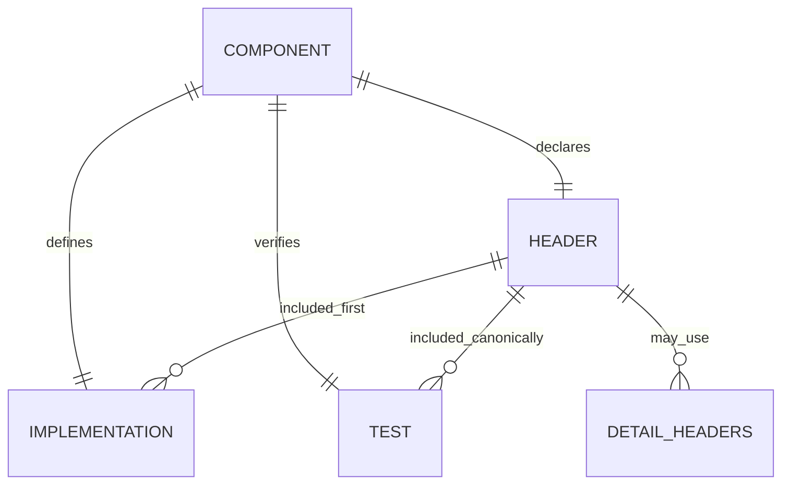
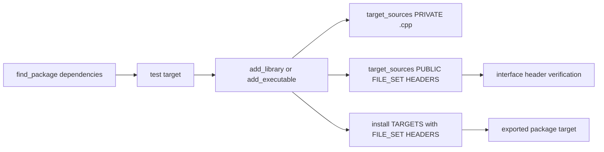

Canonical C++ and CMake House Style
Date: 2026-04-28
Language: en-US
Executive Summary
> **Purpose:** make structure obvious, interfaces stable, and patches boring in the best possible way.
> **Tone:** pragmatic, direct, and opinionated. This is a house style, not a menu.
> **Audience:** written so that people and automated tooling can follow the same rules without guesswork.
> **Requested tables included:** a layout comparison table and a filename suffix mapping table.
This house style is derived from two repository patterns plus a package-oriented view of large software. The precedence is explicit: merged-src example > split include/src/tests example > Lakosian package-group principles > other guides. When patterns disagree, the merged-src pattern wins. The result is intentionally local, coherent, and target-oriented: a component’s interface, implementation, and tests live together under `src/`; public headers have one canonical include name; ordinary functions are declared before being defined out of line; and CMake models ownership through targets and file sets rather than through loose global lists. [BDE; CMake-FileSets; CMake-VerifyHeaders]. citeturn9search0turn12search10turn11search4
The point is not novelty. The point is to make the right structure easier to generate than the wrong one. Self-contained public headers, explicitly qualified out-of-line definitions, stable include spelling, and target-based installation all narrow the space for accidental breakage. That is why the rules below are intentionally opinionated. [Google-Headers; LLVM-Qualified; CMake-FindPackage]. citeturn10search2turn9search1turn13search1
This document is meant to be followed by humans and automated assistants alike. It is self-contained in the body text, but it includes citation keys and a BibTeX bibliography at the end so the design rationale can be audited without cluttering the rules themselves. Wherever a detail is not fixed by this report or by a local codebase, it is marked no specific constraint. [BDE; CMake-MinimumRequired]. citeturn9search0turn11search6
Scope and Precedence
The precedence order for this house style is:
Priority	Authority	Effect on generated code
Highest	merged-src example	default for new components and new directories
Next	split include/src/tests example	compatibility model for existing split-layout code
Next	Lakosian package-group principles	component discipline, locality, and explicit ownership
Lowest	other guides	secondary only when they do not conflict
The merged-src layout is also pitchfork-shaped in spirit: source, public headers, and tests share a common `src/` root, and examples can live nearby without forcing a separate top-level `include/` tree. The split layout remains useful as a compatibility pattern, and it is still informative for things like namespace-to-path mapping, stable public include names, `detail/` conventions, and `.test.cpp` naming. [Beman-Standard; Google-Headers]. citeturn15search1turn10search2
This precedence has concrete consequences. New components belong under `src/`. A public header, its implementation file, and its test file should be co-located under one namespace-reflecting directory. A header’s canonical include spelling determines both its public identity and where it belongs in the tree. A local `CMakeLists.txt` should describe local files only, not reach sideways or upward across the repository. Finally, if something is large enough to deserve its own tests, it is large enough to deserve being its own component, even if it began life as a detail of another type. [BDE; Beman-Standard; CMake-FileSets]. citeturn9search0turn15search1turn12search10
The following details have no specific constraint unless a repository already establishes them: project name, namespace root, license choice, test framework, formatter, module adoption, shared-versus-static default, and exported package namespace.
Representative Layouts
Layout comparison table
Topic	Authoritative merged-src layout	Compatibility split layout
Public headers	`src/<namespace-path>/`	`include/<namespace-path>/`
Implementations	same directory as header	`src/<namespace-path>/`
Tests	same directory as component	`tests/<namespace-path>/`
Examples	nearby subtree such as `src/examples/`	top-level `examples/`
Public include spelling	canonical logical include path	canonical logical include path
Preferred new header suffix	`.hpp`	`.hpp`
Preferred new test suffix	`.test.cpp`	`.test.cpp`
Compatibility suffixes	`.h`, `.t.cpp`	`.h`, `.t.cpp`
CMake ownership	local directory owns local files	same
Filename suffix mapping table
Role	Preferred suffix	Accepted compatibility suffix	Default placement
Public header	`.hpp`	`.h`	`src/<namespace-path>/`
Implementation	`.cpp`	`.cpp`	same directory
Test	`.test.cpp`	`.t.cpp`	same directory
Internal helper header	`.hpp`	`.h`	`detail/` below component directory
The merged layout is the preferred shape for new work because it keeps interface, implementation, and verification physically local. The split layout remains a compatibility model, especially where an existing subtree already separates `include/`, `src/`, `tests/`, and `examples`. [BDE; Beman-Standard]. citeturn9search0turn15search1
Representative merged-src tree
```text
project-root/
├── CMakeLists.txt
├── cmake/
│   └── ...
└── src/
    ├── CMakeLists.txt
    ├── acme/
    │   ├── CMakeLists.txt
    │   └── net/
    │       ├── CMakeLists.txt
    │       ├── socket.hpp
    │       ├── socket.cpp
    │       ├── socket.test.cpp
    │       └── detail/
    │           └── parse_state.hpp
    └── examples/
        ├── CMakeLists.txt
        └── socket_demo.cpp
```
Representative split layout tree
```text
project-root/
├── CMakeLists.txt
├── include/
│   └── acme/
│       └── net/
│           ├── socket.hpp
│           └── detail/
│               └── parse_state.hpp
├── src/
│   └── acme/
│       └── net/
│           ├── CMakeLists.txt
│           └── socket.cpp
├── tests/
│   └── acme/
│       └── net/
│           ├── CMakeLists.txt
│           └── socket.test.cpp
└── examples/
    ├── CMakeLists.txt
    └── socket_demo.cpp
```
Canonical component directory
```text
src/acme/net/
├── CMakeLists.txt
├── socket.hpp
├── socket.cpp
├── socket.test.cpp
└── detail/
    └── parse_state.hpp
```
The canonical component directory is not an accident. It makes one fact obvious: a component owns its interface, its implementation, and its tests together. [BDE]. citeturn9search0

C++ House Rules
File naming. Use `snake_case` file names. Prefer `.hpp`, `.cpp`, and `.test.cpp` for new work. Accept `.h` and `.t.cpp` only when matching an existing subtree that already uses them. The rationale is straightforward: new work should be uniform, but compatibility work should not gratuitously rename the local world. [Beman-Standard; BDE]. citeturn15search1turn9search0
```text
Preferred:
socket.hpp
socket.cpp
socket.test.cpp

Compatibility:
socket.h
socket.cpp
socket.t.cpp
```
Canonical file comment, Emacs mode line, and SPDX placement. Every source-like file begins with the canonical repository-relative file name and an Emacs mode line on line one. SPDX comes immediately after on the next comment-capable line. This standardizes file identity and makes path intent visible inside the file itself. [BDE; Beman-Standard]. citeturn9search0turn15search0
```cpp
// src/acme/net/socket.hpp                                          -*-C++-*-
// SPDX-License-Identifier: <project-license>
#ifndef INCLUDED_ACME_NET_SOCKET
#define INCLUDED_ACME_NET_SOCKET

namespace acme::net {
class socket;
}

#endif
```
For CMake:
```cmake
# src/acme/net/CMakeLists.txt                                      -*-CMake-*-
# SPDX-License-Identifier: <project-license>
```
Three-file component trio. A logical component is represented by a header, an implementation file, and a test file. In the authoritative layout, those three files are co-located under `src/<namespace-path>/`. This preserves component discipline while keeping maintenance local. If a “detail” grows large enough to need its own tests, it should become its own component. [BDE]. citeturn9search0
```text
src/acme/net/
├── socket.hpp
├── socket.cpp
└── socket.test.cpp
```
Namespace-to-path mapping. Namespace, directory path, and public include spelling must match. That is how the codebase tells the truth about ownership and interface identity. [BDE; Google-Headers; Beman-Standard]. citeturn9search0turn10search2turn15search1
```text
Path:      src/acme/net/socket.hpp
Namespace: acme::net
Include:   <acme/net/socket.hpp>
```
```cpp
namespace acme::net {
class socket;
}
```
Canonical include spelling and enforcement. Include project headers only by their canonical include name. Never use relative includes, never include by leaf name when a canonical form exists, and never invent alternate spellings. The canonical include name is the header’s public identity and determines where it belongs under `src/`. [Google-Headers]. citeturn10search2
Good:
```cpp
#include <acme/net/socket.hpp>
```
Bad:
```cpp
#include "socket.hpp"
#include "../net/socket.hpp"
#include "../../src/acme/net/socket.hpp"
```
Header self-containment and interface-header verification. Public headers must include everything they need in order to compile on their own. The practical implication of interface-header verification is blunt: every public header should survive being compiled as “just include this header.” That means no hidden assumptions about prior includes and no transitive-include fragility. [Google-Headers; CMake-VerifyHeaders]. citeturn10search2turn11search4
Good:
```cpp
#include <string_view>

namespace acme::net {
class socket {
public:
    explicit socket(std::string_view endpoint);
};
}
```
Bad:
```cpp
// Missing <string_view>
namespace acme::net {
class socket {
public:
    explicit socket(std::string_view endpoint);
};
}
```
Synopsis-style class declarations must be correct. Public declarations should read like real library synopses, but they still have to be complete and correct. Do not drop concepts, `requires` clauses, or meaningful type constraints just to make a declaration shorter. Pretty lies are still lies. [Google-Headers]. citeturn10search2
```cpp
template <typename T>
concept endpoint_like =
    requires(T t) {
        { t.endpoint() } -> std::convertible_to<std::string_view>;
    };

template <endpoint_like T>
class socket_view;

template <typename T>
requires endpoint_like<T>
void connect(T&& value);
```
Out-of-line qualified definitions. Ordinary functions and methods are defined out of line and explicitly qualified. This avoids accidental new declarations in the wrong scope and forces the definition to match a visible declaration. [LLVM-Qualified; Core-Guidelines]. citeturn9search1turn10search1
Good:
```cpp
#include <acme/net/socket.hpp>

acme::net::socket::socket(std::string_view endpoint)
: d_endpoint(endpoint)
{
}

bool acme::net::is_secure_endpoint(std::string_view endpoint)
{
    return endpoint.starts_with("tls://");
}
```
Bad:
```cpp
namespace acme::net {
bool is_secure_endpoint(char const* endpoint)
{
    return true;
}
}
```
Hidden-friend exception. The main exception to the out-of-line rule is the hidden friend used for a tightly coupled customization point. This is allowed because it is sometimes the cleanest expression of type-local behavior, but it remains narrow and short. [BDE]. citeturn0search6turn9search0
```cpp
class endpoint {
public:
    // HIDDEN FRIENDS
    friend bool operator==(endpoint const&, endpoint const&) = default;
};
```
Constexpr usage and testing. If a facility can meaningfully be constant-evaluated, make it `constexpr`. If constant evaluation is part of the contract, test it with `static_assert` or a compile-time-focused test. Compile-time capability should be explicit, not incidental. [Core-Guidelines]. citeturn10search1
```cpp
constexpr int default_port(bool secure)
{
    return secure ? 443 : 80;
}

static_assert(default_port(true) == 443);
static_assert(default_port(false) == 80);
```
C++ standard preference. Prefer C++23 for new code. Use C++26 where project policy and toolchain support already allow it. The house style is intentionally modern and should not silently backslide to older dialects without a real compatibility need. [Optional-Pattern]. citeturn5search0
```cmake
target_compile_features(acme.net.socket PUBLIC cxx_std_23)
# Raise to cxx_std_26 when policy and toolchain permit it.
```
Compiler warning policy. Maintained C++ code should be warning-free under the repository's target compiler toolchain, which is currently clang. In practice this repository enables warning sets such as `-Wall` and `-Wextra`, and warnings should be treated as defects to fix rather than background noise. The policy is attention to warnings, not blanket `-Werror`: the build does not need to promote every warning to an error for the rule to apply.

No `using namespace` in headers. Never write `using namespace` in a public header. Headers are interface surfaces, not convenience zones. Leaking namespaces through headers damages locality and predictability. [Google-Headers]. citeturn10search2
Bad:
```cpp
using namespace std;  // forbidden in headers
```
Good:
```cpp
#include <string>

namespace acme::net {
using string_type = std::string;
}
```
Include-first rule in `.cpp`. A `.cpp` implementing a component must include that component’s public header first. That catches missing prerequisites in the header and treats the header as the actual interface. [BDE; Google-Headers]. citeturn9search0turn10search2
```cpp
#include <acme/net/socket.hpp>

#include <string>
#include <utility>
```
`detail/` for internals, and no private headers. There are no private headers in the formal sense. Headers under `detail/` are conventionally non-public and may change without notice, but they are still just headers in the source tree. Use `detail/` for non-public textual implementation support. Keep purely file-local helpers in the `.cpp` instead of inventing extra headers. [Beman-Standard]. citeturn15search1
```text
src/acme/net/
├── socket.hpp
├── socket.cpp
└── detail/
    └── parse_state.hpp
```
Header guards versus `#pragma once`. Use include guards as the default policy. Do not introduce `#pragma once` into a guard-based subtree. The point is not ideology; the point is one explicit and uniform mechanism. [BDE; Google-Headers]. citeturn9search0turn10search2
```cpp
#ifndef INCLUDED_ACME_NET_SOCKET
#define INCLUDED_ACME_NET_SOCKET

// header contents

#endif
```
Test naming and placement. In the authoritative layout, tests live next to the component under `src/` and use `.test.cpp` by default. Use `.t.cpp` only when extending a legacy subtree that already speaks that dialect. [Beman-Standard; BDE]. citeturn15search1turn9search0
```text
src/acme/net/
├── socket.hpp
├── socket.cpp
└── socket.test.cpp
```
Test file double-include and TDD bootstrap pattern. Every test file (`.test.cpp` or `.t.cpp`) must enforce header re-inclusion safety and establish a baseline test immediately:

**Double-include verification:**
The target header is included twice—once at the top of the file and once again immediately after—to verify that include guards or `#pragma once` are correctly placed and that the header is idempotent (safe to include multiple times without errors). This catches subtle issues with macro pollution, circular dependencies, or missing guards.

**TDD bootstrap test:**
Before adding substantive tests, add a single tautological test (one that always passes) to ensure build coherency. This test serves as a compile-time signal that the test file itself is correct and can link properly.

**Template:**

```cpp
// src/acme/net/socket.test.cpp                                 -*-C++-*-
// SPDX-License-Identifier: Apache-2.0 WITH LLVM-exception

#include <acme/net/socket.hpp>
#include <acme/net/socket.hpp>  // Re-inclusion verification

#include <catch2/catch_test_macros.hpp>

TEST_CASE("SocketTest - HeaderIsIdempotent")
{
    // Placeholder: verifies header re-inclusion safety and build coherency.
    // This test always passes if the file compiles.
    REQUIRE(true);
}

TEST_CASE("SocketTest - ConstructionBreathing")
{
    acme::net::socket s("localhost:8080");
    CHECK(s.is_connected() == false);
}

TEST_CASE("SocketTest - SemanticBehavior")
{
    // Verify main algorithm or invariant.
    acme::net::socket s1("localhost:8080");
    acme::net::socket s2("localhost:8080");
    CHECK(s1.endpoint() == s2.endpoint());
}
```

**Rationale:**

1. **Re-inclusion safety:** Catches missing `#ifndef` guards or incorrect guard boundaries
2. **Macro isolation:** Verifies first-pass macro definitions do not corrupt second-pass parsing
3. **Build coherency:** A passing re-inclusion test proves the header and implementation can coexist in multiple translation units
4. **TDD discipline:** Tautological test enforces immediate correctness; substantive tests are added in order

**Imperative for new components:**
When adding a new component header, create its test file immediately with this structure before writing substantive tests. Do not defer test creation—the framework structure is stable, and tests can be enriched incrementally.
CMake House Rules
Target-based modern CMake. Use targets as the organizing unit. Define a real target first, then attach sources and headers to it. Directory-wide source piles and global include state are the wrong abstraction. [CMake-FileSets]. citeturn12search10
```cmake
add_library(acme.net.socket)

target_sources(acme.net.socket
  PRIVATE
    socket.cpp
)
```
File sets for headers. Public headers are owned by the target through `FILE_SET HEADERS`. This is the correct place to declare interface headers because it aligns build semantics, include roots, and installation. [CMake-FileSets; CMake-HeaderSets]. citeturn12search10turn12search4
```cmake
target_sources(acme.net.socket
  PUBLIC
    FILE_SET HEADERS
    BASE_DIRS .
    FILES
      socket.hpp
)
```
Local `CMakeLists.txt` only list files in the current directory. A directory-level `CMakeLists.txt` should list only its own local files. Use `add_subdirectory()` to descend. Do not reach sideways into sibling directories or upward through `..`. This keeps ownership obvious and prevents brittle cross-directory enumeration. [CMake-FileSets]. citeturn0search0turn12search10
Good:
```cmake
add_subdirectory(net)
add_subdirectory(examples)
```
Bad:
```cmake
target_sources(acme.net.socket PRIVATE
  ../util/log.cpp
  ../../tests/acme/net/socket.test.cpp
)
```
Prefer `find_package`. Resolve third-party dependencies with `find_package()` unless there is an explicit reason not to. This keeps dependencies declarative and makes the project easier to embed. [CMake-FindPackage; Beman-Standard]. citeturn13search1turn15search0
```cmake
find_package(GTest REQUIRED)

add_executable(acme.net.socket.test socket.test.cpp)
target_link_libraries(acme.net.socket.test
  PRIVATE
    GTest::gtest_main
    acme.net.socket
)
```
Repository note: this repository uses Catch2. `GTest` above is illustrative of the `find_package()` rule, not a directive to switch frameworks.
Avoid single-use variables. Do not create a variable only to hold a file list that is used once. Write the list directly in `target_sources()`. Less indirection means less noise and fewer bad patches. [Beman-Standard]. citeturn15search0
Good:
```cmake
target_sources(acme.net.socket
  PRIVATE socket.cpp
  PUBLIC
    FILE_SET HEADERS
    BASE_DIRS .
    FILES socket.hpp
)
```
Bad:
```cmake
set(ACME_SOCKET_SOURCES socket.cpp)
target_sources(acme.net.socket PRIVATE ${ACME_SOCKET_SOURCES})
```
Install targets, not loose files. Install and export targets. Do not install public headers as disconnected loose files when the target already knows what its public headers are. [CMake-FileSets; CMake-InstallHeaderSets]. citeturn12search10turn12search2
```cmake
install(TARGETS acme.net.socket
  EXPORT acme-targets
  FILE_SET HEADERS
)
```
Minimum CMake version guidance. This repository standardizes on CMake 4.0..4.2. If this house style is reused elsewhere, CMake 3.24+ is the practical floor that comfortably supports the intended file-set and interface-verification workflow, but local repository policy wins when it is stricter. [CMake-MinimumRequired; CMake-VerifyVariable]. citeturn11search6turn11search0
```cmake
cmake_minimum_required(VERSION 4.0..4.2)
project(acme LANGUAGES CXX)
```
Interface-header verification. Turn on interface-header verification in project-owned builds and CI. If a header is public, it must behave like a real interface and compile on its own. That is the test. [CMake-VerifyHeaders; CMake-VerifyVariable]. citeturn11search4turn11search0
```cmake
set(CMAKE_VERIFY_INTERFACE_HEADER_SETS ON)
```

Operational Checklist and Assumptions

Repository-established lint workflow

This repository does have specific lint and formatting constraints. Use `make lint` for the pre-commit-driven path used by CI. Use `make lint-local` for the equivalent local path when pre-commit hook environment bootstrap is unavailable or undesirable.

The configured toolchain is:

- `clang-format` for C and C++ source files, using the repository's checked-in `.clang-format` files as the formatting authority.
- `gersemi` for CMake formatting and lint-style normalization.
- `markdownlint` for hand-maintained Markdown, with `MD013` disabled globally and an additional GitHub-focused relaxed rule set for the local `trees` Markdown pass.
- `codespell` for prose and source spelling, with repository-local ignore lists and excludes for vendored, copied, or generated material.
- `shellcheck` for shell scripts.
- `checkmake` and `mbake validate` for Makefile validation.
- `gitleaks` for secret scanning. In the local path, scan the working tree contents rather than repository history.

Exclusion policy is also part of the rule set: vendored, generated, copied reference material, exported HTML, and selected slide-generated Markdown are intentionally excluded from lint where cleanup would create noise without improving maintained source.

Compact checklist
Use the merged `src/` layout for new components.
Keep the header, implementation, and test together in one component directory.
Put the canonical repository-relative file name and Emacs mode line on line one.
Put SPDX immediately after the canonical file comment.
Use snake_case file names.
Prefer `.hpp`, `.cpp`, and `.test.cpp` for new work.
Keep namespace, path, and canonical include spelling aligned.
Include project headers only by their canonical include name.
Make public headers self-contained.
Include a component’s own header first in its `.cpp`.
Define ordinary functions out of line and fully qualify them.
Use hidden friends only for tight customization points.
Never write `using namespace` in a public header.
Put non-public textual internals in `detail/`.
In CMake, use targets, file sets, local file lists, `find_package`, and install targets rather than loose files.
Run `make lint` before CI-facing changes when pre-commit is available; otherwise use `make lint-local`.
Let checked-in `.clang-format` files define C and C++ layout; do not hand-format against conflicting local preferences.
Keep maintained C++ code warning-free under the target clang toolchain even though the repository does not globally enforce `-Werror`.
For non-trivial changes: create a git worktree (default) or feature branch, commit when tests pass, merge to main with `--no-ff`.
Explicit assumptions
Topic	Default status
Project name	no specific constraint
Namespace root	no specific constraint
License identifier	no specific constraint
Test framework	repository-established: Catch2
Formatter and lint toolchain	repository-established: `clang-format`, `gersemi`, `markdownlint`, `codespell`, `shellcheck`, `checkmake`, `mbake validate`, and `gitleaks`
Primary warning-clean compiler	repository-established: clang
Module adoption	no specific constraint
Shared vs static library default	no specific constraint
Export namespace	no specific constraint
Where a repository already establishes any of those choices, keep the local choice and apply the rest of this house style around it.
Agentic Instructions
The following rules are imperative for automated agents, CI bots, or any tool acting on behalf of a developer. They supplement the house style above and are not optional.

Before starting non-trivial work, create a git worktree:
```bash
git worktree add ../<branch-name> -b <branch-name>
```
Work exclusively inside that worktree. Do not modify files in the main working tree while a worktree is active. The worktree name should be a short, descriptive, kebab-case summary of the task (e.g. `fix-traversable-lookup`, `add-rope-foldable`).

Commit when and only when the relevant validation passes:
```bash
make test
git commit -m "<imperative subject>" ...
```
Use the narrowest validating target that matches the change. For behavioral changes, run `make test` or the relevant project test target. For lint or documentation changes, run the relevant lint target such as `make lint` or `make lint-local`. Do not commit with failing validation. Do not commit partial work as a stepping stone unless explicitly instructed.

Merge to main with a merge commit. Never fast-forward:
```bash
git -C <repo-root> checkout main
git -C <repo-root> merge --no-ff <branch-name>
```

Do not push to the remote unless the user explicitly requests it.

Bibliography
The entries below are raw BibTeX-form citation data corresponding to the citation keys used above.
```bibtex
@online{BDE,
  title        = {BDE C++ Coding Standards},
  author       = {{Bloomberg}},
  year         = {2024},
  note         = {Published 2024-12-16; used for component discipline, prologues, include-first rules, header guards, and hidden-friend constraints},
  url          = {https://bloomberg.github.io/bde/knowledge_base/coding_standards.html}
}

@online{Beman-Standard,
  title        = {The Beman Standard},
  author       = {{The Beman Project}},
  year         = {2026},
  note         = {Used for split-layout conventions, snake_case file names, .test.cpp naming, detail/ conventions, prefer find_package, and avoiding single-use CMake variables},
  url          = {https://bemanproject.org/docs/beman_standard/}
}

@online{CMake-FileSets,
  title        = {target_sources},
  author       = {{Kitware, Inc.}},
  year         = {2025},
  note         = {File Sets section; used for FILE_SET HEADERS, BASE_DIRS semantics, current-directory-relative paths, and install/export behavior},
  url          = {https://cmake.org/cmake/help/latest/command/target_sources.html}
}

@online{CMake-HeaderSets,
  title        = {HEADER_SETS},
  author       = {{Kitware, Inc.}},
  year         = {2025},
  note         = {Used for the meaning of header file sets as target-owned source-like interface artifacts},
  url          = {https://cmake.org/cmake/help/latest/prop_tgt/HEADER_SETS.html}
}

@online{CMake-InstallHeaderSets,
  title        = {INTERFACE_HEADER_SETS},
  author       = {{Kitware, Inc.}},
  year         = {2025},
  note         = {Used for install/export implications of public and interface header sets},
  url          = {https://cmake.org/cmake/help/latest/prop_tgt/INTERFACE_HEADER_SETS.html}
}

@online{CMake-VerifyHeaders,
  title        = {VERIFY_INTERFACE_HEADER_SETS},
  author       = {{Kitware, Inc.}},
  year         = {2025},
  note         = {Used for the mechanics and implications of verifying public headers as self-contained interfaces},
  url          = {https://cmake.org/cmake/help/latest/prop_tgt/VERIFY_INTERFACE_HEADER_SETS.html}
}

@online{CMake-VerifyVariable,
  title        = {CMAKE_VERIFY_INTERFACE_HEADER_SETS},
  author       = {{Kitware, Inc.}},
  year         = {2025},
  note         = {Used for practical guidance on enabling interface-header verification in project-owned workflows},
  url          = {https://cmake.org/cmake/help/latest/variable/CMAKE_VERIFY_INTERFACE_HEADER_SETS.html}
}

@online{CMake-FindPackage,
  title        = {find_package},
  author       = {{Kitware, Inc.}},
  year         = {2025},
  note         = {Used for dependency resolution guidance and package-discovery semantics},
  url          = {https://cmake.org/cmake/help/latest/command/find_package.html}
}

@online{CMake-MinimumRequired,
  title        = {cmake_minimum_required},
  author       = {{Kitware, Inc.}},
  year         = {2025},
  note         = {Used for minimum-version and policy-version guidance},
  url          = {https://cmake.org/cmake/help/latest/command/cmake_minimum_required.html}
}

@online{Core-Guidelines,
  title        = {C++ Core Guidelines},
  author       = {Bjarne Stroustrup and Herb Sutter and contributors},
  year         = {2025},
  note         = {Used for constexpr rule F.4 and the note encouraging larger member functions to be made out of line},
  url          = {https://isocpp.github.io/CppCoreGuidelines/CppCoreGuidelines?lang=en}
}

@online{Google-Headers,
  title        = {Google C++ Style Guide},
  author       = {{Google}},
  year         = {2025},
  note         = {Used for self-contained headers, canonical include spelling without relative aliases, namespace hygiene, and include-order guidance},
  url          = {https://google.github.io/styleguide/cppguide.html}
}

@online{LLVM-Qualified,
  title        = {LLVM Coding Standards},
  author       = {{LLVM Project}},
  year         = {2025},
  note         = {Used for the rule favoring explicitly qualified out-of-line definitions over reopened namespace blocks},
  url          = {https://llvm.org/docs/CodingStandards.html}
}

@online{Optional-Pattern,
  title        = {optional repository README},
  author       = {{bemanproject}},
  year         = {2025},
  note         = {Used for evidence that the split-pattern family is intentionally modern and centered on C++23-era practice},
  url          = {https://github.com/bemanproject/optional}
}
```
