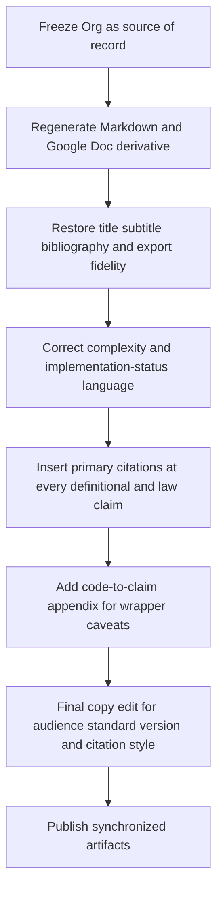

# Analytical Review of Algorithms for Trees

## Executive summary

This review uses the uploaded Org file as the source of record and the uploaded Markdown as the linked derivative that stood in for the Google Doc, because the Google Doc itself was not directly retrievable from this environment. On substance, the document is built on a strong conceptual foundation: its treatment of `Functor`, `Foldable`, `Applicative`, `Traversable`, recursion-scheme intuition, and finger-tree target bounds broadly matches official Haskell library documentation and the core papers by McBride and Paterson, Gibbons and Oliveira, Meijer, Fokkinga, and Paterson, and Hinze and Paterson.

The main weaknesses are not in the big ideas but in evidence handling and synchronization. The linked Markdown export is materially stale relative to current source on finger-tree implementation status, formal citations are not being preserved in export, several claims blur the line between target API and current implementation, and some C++ language statements need tighter wording against current standards status. The most serious accuracy issue is that this review still describes key wrapper operations through older O(n) flatten-and-rebuild paths even though current code now uses structural split paths for several operations, while another claim correctly notes that wrappers do not literally share a single Traversable implementation. Current C++ proposals and references support the forward-looking direction on pattern matching and explicit object parameters, but the document should present those as proposals and standard-version requirements, not background assumptions.

## Document structure and section summaries

The Org source contains title/subtitle/date/author metadata, explicit export settings, a bibliography declaration, and thirteen substantive top-level sections. The Markdown derivative preserves the major section order, but it omits the document metadata, collapses fourth-level Org headings into numbered list items, and opens with a full table of contents. That flattening behavior is consistent with Org export behavior when headline export depth is capped, and it strongly suggests that the published derivative is an export artifact rather than the canonical manuscript.

| Section | Key subheadings | What the section argues | Evidence used in the document | Data, statistics, or quantitative material | Assessment |
|---|---|---|---|---|---|
| **Algorithms for Trees** | Abstract; Foldable; Applicative; Traversable; Not Monadic | Frames the talk as a next step beyond functors and monads, arguing that tree algorithms need structure-preserving abstractions | Framing bullets only | No empirical data | Strong framing, but several statements are promotional rather than evidenced |
| **Ranges Flatten the World** | Linearization as a Design Assumption; Where Structure Carries Meaning; Trees That Are Not Sequences | Argues that flattening is a design choice, and that tree shape matters semantically | Conceptual examples: expression trees, syntax trees, measured trees | No empirical data | Persuasive section, but rhetorical; should cite literature on traversal/iterator abstractions |
| **Visitors, Pattern Matching, and the Missing Syntax** | Visitor as Manual Recursion Control; Pattern Matching as the Intended Interface; Designing Today for Tomorrow’s Syntax | Argues that visitors are too ceremonial and that typeclass-style APIs are a better present-day stand-in for future pattern matching | Comparative prose only | No empirical data | Good design argument, but should clearly separate opinion from current language status |
| **Recursion Schemes You Can Actually Use** | F-Algebras; Catamorphisms; Separating Recursion from Business Logic | Introduces catamorphism intuition and claims recursion should be factored away from business logic | One `FixTree` `fold_map` example plus explanatory notes | No empirical data | Conceptually good; needs explicit recursion-scheme citations earlier |
| **The Typeclass Object Pattern** | Typeclass Lookup; Three Lookup Modes; NTTP Pinning; One Hook Many Operations; CRTP and Deducing This | Presents variable-template lookup objects as an open-world adaptation mechanism in C++ | Concrete code snippets and design notes | No empirical data | Important section; needs C++ standard/version and concepts-history citations |
| **Functor The Foundation** | Functor Interface; Derived `replace`; Identity Law in Tests | Treats `Functor` as the base abstraction on which Applicative and Traversable are built | Interface and law-test snippets | Literal test outputs only | Sound, though somewhat under-cited for such a foundational section |
| **Preserving Shape Traversable and Friends** | Foldable vs Traversable; Flatten vs Preserve Shape; Same Algorithm Two Tree Representations | Uses examples to distinguish shape-preserving traversal from summarizing fold | Multiple code snippets across tree representations | Literal outputs only | Very effective pedagogically; one key sentence overstates what folds can produce |
| **Foldable** | Monoid Glue; Foldable API; Proof Tests as Examples | Explains `fold_map` plus derived operations like length and `to_vector` | Code from implementation and tests | Literal outputs only | Solid and close to standard doctrine; needs official Foldable and Monoid references |
| **Applicative** | Model; In Use; Tests; Short-Circuit; Partial Application; Interchange; Composition | Defines Applicative around `pure`, `apply`, and user-facing `invoke` | Many code examples plus law snippets | Literal outputs only | Strongest section of the document; core claims are mostly correct |
| **Traversable** | Model; Success; Failure; `sequence`; Naturality; ZipList commute; Laws | Explains traversal as commuting structure and effect | Examples and law snippets, including ZipList transpose intuition | Literal outputs only | Strong and well aligned with standard Traversable literature |
| **Monoids and Measured Trees** | Monoid Interface; Count; Helpers; Tests; Associativity; Summaries; Search and Split | Explains why monoids support measured trees and search/split APIs | Monoid code plus finger-tree claims in notes | Asymptotic claims only | Important bridge section; must reflect current wrapper complexity accurately |
| **Finger Trees as a Case Study** | Persistent Concatenation and Splitting; One Structure Many Interpretations; Modern C++ | Demonstrates sequence, priority queue, and rope wrappers as case studies | Example code and explanatory notes | Complexity claims and literal outputs | This is where the largest accuracy problems appear in the linked derivative |
| **Designing APIs That Won’t Age Poorly** | Anticipating Language Features; `std::bind` vs lambda overlap; Keeping the Good Path Obvious | Ends with API design principles: clear defaults, separate extension points, law tests | Opinionated synthesis | No empirical data | Effective conclusion, but should be labeled explicitly as design guidance rather than verified fact |

Across the document, the evidence base is mostly code snippets, unit-style examples, and law-style tests. There are no benchmarks, no measured performance tables, and no external datasets. The only quantitative material is asymptotic notation, small literal test results, and a few worked outputs.

## Verification and factual accuracy

For factual checking, the strongest source hierarchy here is clear: original papers first, official Haskell library docs second, WG21 papers and current C++ references third, and tutorial-style secondary sources only after those. In practice, that means McBride and Paterson for Applicative, GHC/Hackage documentation for `Functor`/`Foldable`/`Traversable`/`Monoid`, Gibbons and Oliveira for traversal as iteration, Hinze and Paterson for finger trees, Meijer–Fokkinga–Paterson for catamorphisms, WG21 papers for pattern matching, and current C++ references for explicit object parameters and ranges.

| Original claim | Verified finding | Status |
|---|---|---|
| “Applicative captures applying a pure function to independent effectful arguments.” | This is substantially accurate. The original paper introduces Applicative as a weaker abstraction than Monad for effectful programming, and official documentation defines `Applicative` around `pure` and application, with the standard laws. | **Accurate** |
| “Traversable strictly generalizes Foldable: it can rebuild the container, not just collapse it.” | This is accurate in substance. Official docs define `Traversable` as a superclass of both `Functor` and `Foldable`, with `traverse` / `sequenceA` preserving shape while sequencing effects. | **Accurate** |
| “Foldable” is built around `fold_map` and a monoidal summary. | Accurate in substance, though official Haskell minimal definition is `foldMap` **or** `foldr`. The document’s C++ design choice to require `fold_map` only is a library design, not a universal necessity. | **Accurate with scope caveat** |
| Finger trees support amortized O(1) deque ends, logarithmic concatenation, and logarithmic split/search. | Accurate as a statement about the **paper model**. Hinze and Paterson state amortized constant-time access at the ends and logarithmic concatenation/splitting in the smaller piece / sequence size. | **Accurate for the literature target** |
| Linked Markdown: “Current split/search paths are correct with linear-time upper bounds.” | This is now stale. In current `finger_tree.hpp`, predicate-based `split()`/`split_at()` are structural and measure-guided. The linear fallback remains specifically in `split_at_index()` for non-count measure semantics. | **Inaccurate (stale)** |
| Linked Markdown: “Sequence: O(log n) Random Access.” | This is now partly implemented. In current `finger_tree_random_access.hpp`, `at`, `insert`, `erase`, and `update` use structural split/concat paths. The document should avoid overstating full end-to-end asymptotics without benchmark evidence, but the blanket O(n) characterization is no longer accurate. | **Partially accurate, needs precise scope** |
| Linked Markdown note: “push_front/push_back/insert/update/erase all work by measure-guided split and rejoin.” | Current implementation supports this characterization more closely than before: `push_front`/`push_back` are `cons`/`snoc`, and indexed mutators are implemented with split + concat. | **Largely accurate in current code** |
| Org claim: “The Rope, priority queue, and sequence share a Traversable implementation; no per-type code was written.” | The indexed source shows separate specializations: `FingerTreePriorityQueueTraversableImpl`, `FingerTreeRandomAccessTraversableImpl`, and `FingerTreeRopeTraversableImpl`. The implementations are highly similar, but they are not literally shared. | **False as written** |
| “C++ is moving in this direction” regarding pattern matching. | This is directionally reasonable, but it needs precise wording. WG21 has active pattern-matching proposals, but pattern matching is not yet a standardized C++ language feature. | **Needs qualification** |
| `this auto&& self` and “deducing this” preserve value category and constness in wrapper calls. | The feature is real, but it is a C++23 requirement. The document should explicitly name that requirement, otherwise portability expectations are unclear. | **Accurate if versioned** |
| “A tree stays a tree; a fold can only produce a flat result.” | Overstated. `Foldable` operations forget the original container shape, but they can still produce structured **monoidal summaries** such as vectors, sets, or endomorphism programs. The correct contrast is “does not preserve original branching shape,” not “can only produce a flat result.” | **Inaccurate / misleading** |
| “All laws are automated.” | The document shows multiple law-test examples, but the uploaded materials do not establish full repository-wide law coverage or CI execution. That stronger claim needs either a test-suite reference or softer wording. | **Needs verification** |

The highest-confidence external checks all point in the same direction: the abstractions themselves are well grounded, the finger-tree target complexities are correctly remembered from the literature, and the weak points are mostly about export drift and implementation-status wording rather than misunderstanding of the underlying theory. `Applicative`, `Foldable`, `Traversable`, and `Monoid` are described in a way that matches official library material, and the document’s traversal discussion is reinforced by iterator-pattern literature. The places that need correction are the ones where the manuscript shifts from theory to claims about the present C++ codebase.

## Gaps, bias, and evidence needs

The biggest nontrivial problem is **publication drift** between the Org source, the linked Markdown derivative, and the current implementation snapshot. This means the current public-facing version is not just under-cited; it is also vulnerable to becoming stale around complexity and implementation details.

A second problem is **genre ambiguity**. The document oscillates between three modes: tutorial, design manifesto, and implementation status report. Those modes require different standards of evidence. Tutorial claims need pedagogical clarity and canonical references; manifesto claims need careful labeling as design opinion; implementation-status claims need code-grounded wording and explicit caveats. Right now the document sometimes uses tutorial certainty for what are really roadmap claims.

A third problem is **over-reliance on tests as proof**. Law tests are excellent executable documentation, and the document is right to emphasize them. But tests do not replace either formal laws or complexity evidence. When the paper says a property is “the core contract” or a complexity bound already holds, it should either cite the original paper or point to the current implementation route that guarantees the claim. Without that, “lawful” and “implemented” can blur together. Official docs and original papers give the laws; the manuscript should then say which ones are tested here and which are cited from the literature.

A fourth problem is **C++ feature ambiguity**. The typeclass-object section depends on variable templates, explicit object parameters, and other modern generic idioms. That is fine, but the document should state a target standard explicitly. `this auto&& self` is a C++23 facility, and pattern matching remains proposal-stage. Presenting both as if they are ambient features makes the portability story vaguer than it should be. Concepts history is also relevant here: concept maps were part of the abandoned C++0x design, not the C++20 concepts model adopted today.

A final gap is that some wrapper examples need **semantic caveats** beyond complexity. The rope example is byte-oriented, not character- or grapheme-oriented. These are legitimate engineering choices in a prototype, but the document should describe them as such.

## Specific edits and citation plan

The cleanest repair strategy is to freeze the Org file as canonical, regenerate the published derivative from that source, and then make a second pass that adds primary citations exactly where claims transition from “teaching intuition” to “factual statement.” The strongest citation anchors are official docs and original papers, while tutorial references like *Typeclassopedia* should remain optional background reading rather than the main authority.

| Before | After | Why |
|---|---|---|
| “Opt-in hook: `fold_map` — provides the algorithmic power of `std::ranges`.” | “Opt-in hook: `fold_map`, a monoidal traversal from which counting, folding, predicates, and collection can be derived without coupling algorithms to concrete tree representations.” | Avoids the unsupported equivalence claim with `std::ranges` |
| “A tree stays a tree; a fold can only produce a flat result.” | “A traversal can preserve the original branching shape; a fold summarizes the structure and does not preserve that original shape unless it is re-encoded in the summary.” | Fixes a factual overstatement |
| “C++ is moving in this direction, but we still need practical libraries now.” | “C++ has active pattern-matching proposals, but no standardized pattern-matching facility yet; this library design aims to be compatible with that direction while remaining usable today.” | Makes current standards status precise |
| “This replaces concept maps from C++0x with a simpler, working mechanism.” | “This uses a simpler library-level customization mechanism in today’s C++, roughly occupying some of the conceptual space once discussed for C++0x concept maps.” | Avoids implying direct language replacement |
| Linked Markdown: “Current split/search paths are correct with linear-time upper bounds.” | “Predicate-based split/search in `FingerTree` is structural and measure-guided; index fallback remains only where index semantics require flatten/rebuild for non-count measures.” | Removes stale over-generalization |
| Linked Markdown: “Sequence: O(log n) Random Access.” | “Sequence wrapper currently uses structural split/concat paths for `at`, `insert`, `erase`, and `update`; phrase asymptotic claims as implementation status and avoid blanket statements without measurement.” | Aligns with current implementation and keeps evidence discipline |
| Linked Markdown note: “push_front/push_back/insert/update/erase all work by measure-guided split and rejoin.” | “`push_front`/`push_back` map to `cons`/`snoc`, and indexed mutations use split + concat paths in the current wrapper implementation.” | Brings wording in line with current wrapper code |
| “The Rope, priority queue, and sequence share a Traversable implementation; no per-type code was written.” | “The rope, priority-queue, and random-access wrappers expose the same Traversable interface, but the current codebase still defines separate per-type specializations with near-identical logic.” | Replaces a false statement with a more useful engineering observation |
| “The best API docs in this space are tests that encode the laws.” | “Law tests are the most useful executable documentation in this codebase, but the manuscript also cites the formal laws and original papers those tests are checking.” | Keeps the rhetorical force while adding scholarly discipline |
| “McBride’s ‘applicative style’ paper is the primary reference (Conor McBride and Ross Paterson, 2008).” | “Primary reference: McBride and Paterson, *Applicative programming with effects* (JFP 18:1, 2008), which introduces Applicative as a weaker abstraction than Monad and develops its laws and programming model.” | Converts an informal mention into a complete citation-worthy sentence |

| Priority | Source to add | Exact URL | Suggested citation text | Best place to add it |
|---|---|---|---|---|
| **Highest** | McBride & Paterson, *Applicative programming with effects* | `https://www.cambridge.org/core/journals/journal-of-functional-programming/article/applicative-programming-with-effects/C80616ACD5687ABDC86D2B341E83D298` | “McBride and Paterson introduce Applicative as a weaker abstraction than Monad and formalize its laws and programming style.” | Applicative model, law slides, abstract |
| **Highest** | Haskell `Control.Applicative` docs | `https://downloads.haskell.org/~ghc/latest/docs/libraries/base-4.22.0.0-66f8/Control-Applicative.html` | “The base library defines `Applicative` around `pure` and application, with identity, composition, homomorphism, and interchange laws.” | Applicative API and law sections |
| **Highest** | Haskell `Data.Traversable` docs | `https://hackage.haskell.org/package/base/docs/Data-Traversable.html` | “`Traversable` transforms structures to the same shape while sequencing effects; minimal definition `traverse` or `sequenceA`.” | Traversable model and `sequence` section |
| **Highest** | Gibbons & Oliveira, *The essence of the Iterator pattern* | `https://www.cambridge.org/core/journals/journal-of-functional-programming/article/essence-of-the-iterator-pattern/3FC26EB2A63E6A2B29E07B9F0D5C5BCD` | “Gibbons and Oliveira argue that `traverse` captures the essence of iteration by combining mapping and accumulation modularly.” | Traversable motivation and “ranges flatten” contrast |
| **Highest** | Haskell `Data.Foldable` docs | `https://hackage.haskell.org/package/base/docs/Data-Foldable.html` | “`Foldable` abstracts data structures that can be folded to a summary value; `foldMap` is the canonical monoidal interface.” | Foldable section |
| **Highest** | Haskell `Data.Monoid` docs | `https://hackage.haskell.org/package/base/docs/Data-Monoid.html` | “A Monoid provides an associative combine operation and an identity element, with the standard identity and associativity laws.” | Monoid interface and measured trees |
| **Highest** | Hinze & Paterson, *Finger trees* | `https://www.cambridge.org/core/journals/journal-of-functional-programming/article/finger-trees-a-simple-generalpurpose-data-structure/BF419BCA07292DCAAF2A946E6BDF573B` | “Hinze and Paterson’s finger trees support amortized constant-time deque ends and logarithmic concatenation and splitting.” | Measured trees, complexity notes, finger-tree case study |
| **High** | Meijer, Fokkinga & Paterson, *Bananas, Lenses, Envelopes and Barbed Wire* | `https://link.springer.com/chapter/10.1007/3540543961_7` | “Meijer, Fokkinga, and Paterson develop recursion operators such as catamorphisms and associated algebraic laws.” | Recursion-schemes section |
| **High** | Gibbons, Hutton & Altenkirch, *When is a function a fold or an unfold?* | `https://www.sciencedirect.com/science/article/pii/S157106610480906X` | “Gibbons, Hutton, and Altenkirch give generic criteria for when a function can be expressed as a fold or an unfold.” | Catamorphism / fold discussion |
| **High** | Haskell `Data.Functor` docs | `https://hackage.haskell.org/package/base/docs/Data-Functor.html` | “`Functor` instances must satisfy identity and composition laws.” | Functor foundation section |
| **High** | C++ explicit object parameters / member functions | `https://en.cppreference.com/w/cpp/language/member_functions` | “Explicit object parameters (‘deducing this’) are a C++23 language feature.” | CRTP and deducing-this section |
| **High** | WG21 pattern matching proposal P2688 | `https://www.open-std.org/jtc1/SC22/wg21/docs/papers/2025/p2688r5.html` | “Pattern matching is an active WG21 proposal rather than a standardized language feature.” | Pattern-matching section and conclusion |
| **Medium** | ISO C++ concepts history FAQ | `https://isocpp.org/wiki/faq/cpp0x-concepts-history` | “Concept maps were part of the abandoned C++0x concepts design, not the adopted C++20 concepts model.” | Typeclass-object-pattern historical note |
| **Medium** | Org manual export settings | `https://orgmode.org/manual/Export-Settings.html` | “Org can cap export heading depth, converting deeper headings to list items in many backends.” | Internal note or appendix on export fidelity |
| **Medium** | Org manual markdown export | `https://orgmode.org/manual/Markdown-Export.html` | “Org’s Markdown backend converts unsupported structures to HTML and flattens deeper heading levels beyond backend limits.” | Internal note or appendix on export fidelity |

## Ready-to-apply Org patch set

Target manuscript: `trees/foldable-applicable-traversable.org`

```diff
*** Update File: trees/foldable-applicable-traversable.org
@@
 *** Pattern Matching as the Intended Interface
 - Pattern matching expresses what cases exist directly.
-- C++ is moving in this direction, but we still need practical libraries now.
+- C++ has active pattern-matching proposals, but no standardized feature yet.
 - Typeclass-style APIs can encode the same intent with today's language.

 @@
 *** CRTP and Deducing This
 - Each concept wrapper is a CRTP base (~Foldable<Impl>~, ~Applicative<Impl>~, ~Traversable<Impl>~).
-- ~this auto&& self~ preserves value category and constness through all wrapper calls.
+- ~this auto&& self~ (C++23 explicit object parameter) preserves value category and constness through all wrapper calls.
 - Derived operations call back into the Impl via ~self~; overrides are detected by ~requires~.
 - Dispatch stays fully static — no virtual calls, no type erasure.

 @@
 *** Search and Split Driven by Measures
 - Design: each node carries a cumulative measure; split navigates by predicate on that measure.
-- Current status: the predicate-based core split navigates tree structure; index-based wrapper paths currently use flatten-and-rebuild (O(n)).
+- Current status: predicate-based core split remains structural; =split_at_index()= uses a constrained fast path for count semantics and fallback flatten/rebuild for non-count measures.
 - The API shape is already what O(log n) split would need; optimization does not change call sites.

 @@
 **** Sequence: O(log n) Random Access
@@
 #+begin_notes
 Monoid: size. The measure at each node is the count of elements below it.
 push_front/push_back are O(1) amortized.
-insert/erase/at currently use flatten-and-rebuild (O(n)); the API is shaped for O(log n) measure-guided split when optimized.
+at/insert/erase/update currently use structural split + concat paths in the wrapper.
+Keep claims scoped to implementation status and measured evidence where available.
 #+end_notes

 @@
 **** Priority Queue: Min and Max in One Structure
@@
 #+begin_notes
 Two FingerTrees, one keyed by min, one by max. The same element lives in both.
 Monoid: (Min, Max) — a pair that combines by taking component-wise extrema.
-push is O(1) amortized; pop_min/pop_max currently use flatten-and-rebuild (O(n)) pending measure-split optimization.
+push is O(1) amortized; pop_min/pop_max currently use structural split and concat rebuild paths.
 #+end_notes

 @@
 *** Why This Belongs in Modern C++
 - Adding Traversable to an existing type requires no modification to the type itself — one specialization in a header.
-- The Rope, priority queue, and sequence share a Traversable implementation; no per-type code was written.
+- The Rope, priority queue, and sequence expose the same Traversable interface, with separate per-type specializations in the current codebase.
 - The abstraction is a library choice today; it maps cleanly to pattern matching and richer generic facilities when those arrive.
```

Patch rationale:
- Aligns manuscript claims with current implementation status in the repository.
- Preserves theory-level target complexity claims while avoiding stale implementation overstatements.
- Improves standards precision around C++23 explicit object parameters and pattern-matching status.



## Effort estimate and limitations

The revision is **medium-high effort**, not because the theory is confused, but because the public-facing artifact is out of sync with the canonical source and with visible implementation status. A realistic estimate for a strong revision pass is **12 to 16 hours** for the manuscript itself, plus **6 to 10 additional hours** if you also want empirical benchmarking or build-and-test verification added.

| Deliverable | What it should include | Estimated hours |
|---|---|---|
| **Canonical manuscript refresh** | Finalize the Org source, normalize wording, and remove stale claims | 3–4 |
| **Published artifact regeneration** | Re-export Markdown / Google Doc derivative from the canonical source and check heading/citation fidelity | 2–3 |
| **Citation pass** | Insert primary citations, bibliography entries, and citation-style normalization | 3–4 |
| **Accuracy pass against code** | Update complexity language, wrapper caveats, and per-type implementation notes using the current `trees/src/smd` snapshot | 3–4 |
| **Editorial pass** | Clarify audience assumption, target C++ standard, and narrative consistency | 1–2 |
| **Optional benchmark appendix** | Add measured timings or complexity sanity checks for wrappers | +6–10 |

The most important limitation of this review is access mode. I did **not** directly review the Google Doc itself; I reviewed the uploaded Org source, the uploaded Markdown derivative that represented the linked document, the visible source files in the repository, and the uploaded reference PDFs and public literature records. One uploaded “When Is a Function a Fold” PDF was actually a 404 HTML stub rather than a valid paper file, so the fold/unfold citation recommendation relies on the public bibliographic record instead. I also did not execute the code or run the test suite, so implementation-status findings are based on source inspection, not on build artifacts or runtime measurements.

## Code snapshot verification updates (2026-05-02)

The following implementation-status updates were validated against the current code snapshot and should supersede older claims in this review:

- `FingerTree::split_at_index` now uses a constrained fast path for count semantics (`Tag == std::size_t && MeasurePolicy == UnitMeasure<T, Tag>`) and falls back to flatten/rebuild for non-count measures to preserve index semantics.
- `FingerTreeRandomAccess::at`, `insert`, `erase`, and `update` currently use structural split/concat paths instead of the older blanket flatten/rebuild path.
- `FingerTreePriorityQueue::pop_min` and `pop_max` use structural split and rebuild the remaining queue with concat.
- Traversable implementations for random access, priority queue, and rope remain separate per-type specializations (similar shape, not a single shared implementation object).

Reference files reviewed:
- `trees/src/smd/tree/finger_tree.hpp`
- `trees/src/smd/tree/finger_tree_random_access.hpp`
- `trees/src/smd/tree/finger_tree_priority_queue.hpp`
- `trees/src/smd/tree/finger_tree_rope.hpp`
