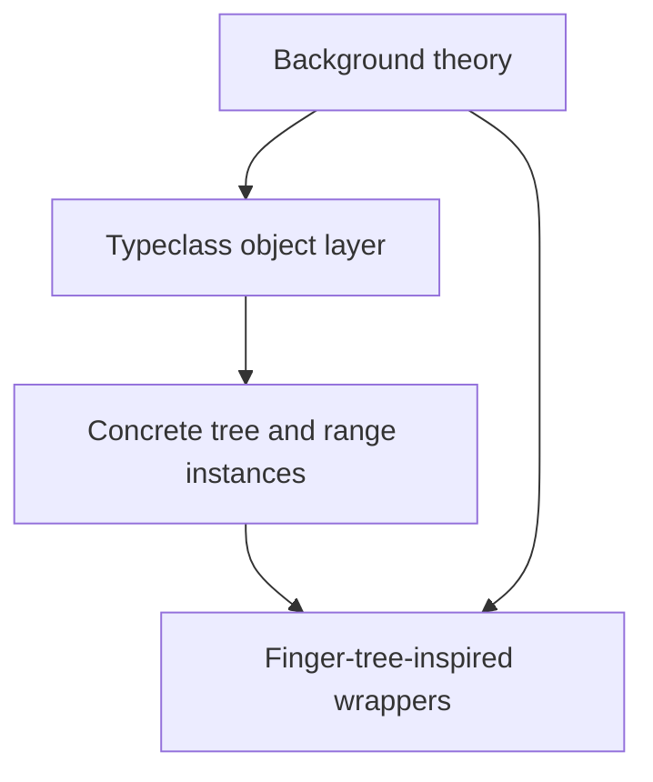

# Review of the Trees Slide Deck and Source Snapshot

## Executive summary

The strongest part of this project is the **typeclass-object framework itself**. The repository’s implementations of `Foldable`, `Applicative`, and `Traversable` line up well with the standard Haskell-inspired account: a minimal primitive per concept, derived user-facing operations, and explicit lookup objects instead of ad hoc member methods. On that core point, the slides are mostly accurate, and the code is coherent. The background literature also supports the talk’s central framing: `Foldable` summarizes structure, `Applicative` applies effectful functions to effectful arguments, and `Traversable` sequences effects while preserving outer shape. fileciteturn0file33turn0file29turn0file34

The biggest **correctness issue** is the current `zip_list` applicative. In standard lawful zip-style applicative semantics, identity requires `pure id <*> v = v`. The repository’s `zip_list` implementation zips in `apply`, but `pure` returns a singleton list, so the identity law fails for any list longer than one element. Because the slides present ZipList as one of the “convincing applicative instances,” this is the single most important code-level issue to fix before using the deck as a correctness-focused talk. The law itself is standard Applicative doctrine. fileciteturn0file33

The biggest **slide/code mismatch** is in the finger-tree section. The current core `FingerTree` implementation is **not** a direct implementation of Hinze–Paterson 2–3 finger trees. It is better described as a **finger-tree-inspired persistent measured concatenation tree** with a similar API surface and monoidal-measure story, but a different internal representation and weaker wrapper-level asymptotics. That distinction matters, because the literature’s signature results for finger trees are amortized constant-time deque operations and logarithmic split/concatenation for the general structure, while your wrappers for priority queue, interval index, and random access still flatten or rebuild whole structures in important operations. fileciteturn0file32turn0file31

The biggest **bibliographic problem** is that the deck is not yet citation-ready. The source Org file still contains multiple `CITE_PLACEHOLDER` markers, and it points to bibliography files that are not present in the repository snapshot (`../etc/wg21.bib`, `../etc/local.bib`). So the talk already knows where citations are needed, but the citation pipeline is incomplete.

My bottom-line verdict is this: **the presentation is conceptually strong and mostly honest about the typeclass abstractions, but it needs a round of law-fixing, asymptotic clarification, and bibliography completion before it can safely claim full agreement between slides, implementation, and literature.**

## Accuracy verdict

A useful way to read the repo is as three layers:



At the theory level, the talk’s abstractions are well chosen. The Haskell ecosystem’s standard explanations match the deck’s main distinctions: `Functor` maps structure-preservingly; `Applicative` embeds values with `pure` and applies effectful functions with `<*>`; `Traversable` distributes or sequences effects while preserving outer shape; and finger trees rely on monoidal annotations to support generic splitting/search interpretations. fileciteturn0file33turn0file32turn0file31

At the implementation level, the typeclass-object layer accurately mirrors that theory. `Foldable` is primitive-on-`fold_map`, `Applicative` is primitive-on-`pure` and `apply`, and `Traversable` is primitive-on-`traverse`. The “lookup object” pattern is consistent across the repo and is clearly intentional rather than incidental.

Where the deck needs tightening is in the move from **theory** to **claims about this particular codebase**. Two examples stand out.

The first is **ZipList**. Standard zip applicatives are a canonical example in the literature, but the repo’s `zip_list` implementation does not currently implement the standard lawful semantics because `pure` is not shape-neutral. The deck should not present it as a settled, law-abiding instance until that is fixed. The Applicative laws the instance ought to satisfy are standard and explicitly spelled out in the background material. fileciteturn0file33

The second is **finger trees**. The original finger-tree literature is about a very specific 2–3-finger-tree design with digits and nested nodes, built to achieve strong asymptotic bounds and many measured interpretations. Your code adopts the **measure-centric interpretation layer**, which is the right conceptual part to borrow, but the actual implementation uses `FlatSegment` and `ConcatSegment` under a polymorphic `Segment` interface, not the classical digit spine. That means the deck should describe the implementation as *inspired by* finger trees, not *the* finger-tree implementation from the literature. fileciteturn0file32turn0file31

There is also a smaller but important lecture-design point. The deck’s recursion-scheme material is directionally right, but it is pitched at the “practical catamorphism” level rather than at a full initial-algebra development. That is not a flaw; it is actually appropriate for a C++ audience. The background research you supplied supports exactly that light-touch framing: algebras, catamorphisms, and folds are legitimate background for a “practical folds over recursive structures” story. fileciteturn0file29

## Slide claims mapped to implementation

The table below maps the highest-value claims in the deck to the code that actually supports them.

| Slide claim | Code location | Assessment |
|---|---|---|
| Implement one primitive for `Foldable`, derive the rest | `src/smd/typeclass/foldable.hpp:136-260` | **Accurate.** `length`, `fold_left`, `fold_right`, `combine_all`, `fold`, `any_of`, `all_of`, `empty`, `to_vector`, and `find_first` all derive from `fold_map`. |
| Implement `pure` and `apply`, derive user-facing `invoke` | `src/smd/typeclass/applicative.hpp:96-284` | **Accurate.** The CRTP wrapper does exactly this, with `invoke` derived via `make_terminating_partial` unless an instance overrides it. |
| Implement `traverse`, derive `for_each` and `sequence` | `src/smd/typeclass/traversable.hpp:18-59` | **Accurate.** `sequence` is literally `traverse(identity)`, matching the standard account. |
| Lookup is a variable-template selection like `foldable_typeclass<T>` | `src/smd/typeclass/foldable.hpp:263-264`, `applicative.hpp:286-287`, `traversable.hpp:62-63` | **Accurate.** This is one of the best-executed ideas in the repo. |
| Same algorithm shape across different tree representations | `src/smd/typeclass/examples/foldable_examples.cpp:21-87`; instance files `fix_tree_foldable.hpp`, `binary_tree_foldable.hpp`, `fringe_tree_foldable.hpp` | **Accurate, with a caveat.** The call shape is shared, but the semantic domain differs: `FixTree` folds leaves only, `BinaryTree` folds node values inorder, and `FringeTree` folds leaves. This difference should be stated more explicitly on the slide. |
| Traversable preserves shape while mapping payloads | `src/smd/typeclass/examples/traversable_examples.cpp:37-64`; `fix_tree_traversable.hpp:16-57`; `binary_tree_traversable.hpp:17-102`; `fringe_tree_traversable.hpp:15-55` | **Accurate.** This is one of the deck’s strongest slide-to-code correspondences. |
| The current finger-tree search/split path is a linear scan over the flattened sequence | Slide source `foldable-applicable-traversable.org:410-423`; core implementation `src/smd/tree/finger_tree.hpp:617-663` | **Inaccurate for the core tree.** `FingerTree::search` and `split` descend the segment tree using cached tags; they do not flatten first. This claim is closer to true for some wrappers, not for the core `FingerTree`. |
| One structure can model sequence, priority queue, rope, interval index | `src/smd/tree/finger_tree_random_access.hpp`, `finger_tree_priority_queue.hpp`, `finger_tree_rope.hpp`, `finger_tree_interval_index.hpp` | **Partially accurate.** Semantically yes; asymptotically not yet. Several wrapper operations still flatten or rebuild entire trees. |
| ZipList is a convincing applicative instance in this repo | `src/smd/ziplist/zip_list_applicative.hpp:17-39` | **Not yet accurate.** `apply` zips, but `pure` is singleton rather than law-preserving repeat-style behavior. |
| The finger-tree implementation corresponds to the literature’s finger-tree internals | `src/smd/tree/finger_tree.hpp:21-56` and `:102-724` | **Not accurate.** The file defines `Digit`, `Node2`, and `Node3`, but the actual implementation uses `Segment`, `FlatSegment`, and `ConcatSegment`. This is a different structure with a similar motivation. |

Two additional presentation issues deserve mention.

The first is that the generated Markdown handout is visibly less clean than the Org source and HTML presentations. In the Markdown rendering, several transcluded code regions are garbled or duplicated, and some code examples become hard to read. The Org file is clearly the source of truth.

The second is that the finger-tree discussion in the slides is actually **more careful than the code-adjacent notes imply**. In `finger_tree.hpp`, the public comment explicitly distinguishes the current prototype complexity contract from the stronger asymptotic targets of the original papers (`src/smd/tree/finger_tree.hpp:511-524`). That distinction should be pulled up into the spoken slides, not left in code comments.

## Tests and missing proofs

The repository has a lot of **example-heavy unit coverage**, and that matters. There are executable examples for the slide snippets, separate typeclass tests, tree-specific tests, and wrapper tests. The test surface is substantial enough to support the pedagogical claims that “the slide examples actually run.”

| Test area | Main files | What it really covers | Main gap |
|---|---|---|---|
| Core `Foldable` API | `src/smd/typeclass/foldable.t.cpp` | Derived operations from `fold_map` on a simple `Sequence` model | No property-style law testing across many monoids or many shapes |
| Core `Applicative` API | `src/smd/typeclass/applicative.t.cpp` | Optional and test-identity behavior, partial application, explicit-object dispatch, some identity/homomorphism checks | Composition and interchange are not checked; custom instances are not law-checked systematically |
| Core `Traversable` API | `src/smd/typeclass/traversable.t.cpp` | `traverse`, `for_each`, `sequence`, `sequence_with` on `Identity` | No identity/naturality/composition law suite |
| Tree-specific `Foldable`/`Traversable` | `fix_tree_*.t.cpp`, `binary_tree_*.t.cpp`, `fringe_tree_*.t.cpp` | Shape preservation and example behavior for concrete trees | Behavior examples are good, but proofs of lawfulness are absent |
| Core finger-tree structure | `src/smd/tree/finger_tree.t.cpp` | Core operations, measured search/split behavior, and a logarithmic-depth sanity test | No operation-count tests; no benchmark-based complexity evidence |
| Range and ZipList interoperability | `src/smd/ranges/range_traversable.t.cpp`, `src/smd/ziplist/zip_list_applicative.t.cpp` | Good examples of commuting shapes and zipped application | ZipList laws are not tested, and current `pure` would fail them |

That means the deck’s line “laws that keep this honest” is **conceptually right but empirically overstated**. The repo has many **behavior tests**, not many **law tests**. That is not the same thing.

This matters most for Applicative and Traversable. The literature’s laws are not optional decoration; they are what distinguishes these abstractions from “some convenient helper API.” Typeclassopedia gives the canonical Applicative laws—identity, homomorphism, interchange, composition—and the standard relation `fmap g x = pure g <*> x`. Those are exactly the tests that should be automated for every intended-lawful instance. fileciteturn0file33

The range traversable work is a real bright spot. Restricting `list_range` traversability to `forward_range` is a good design choice, because it avoids pretending that single-pass input ranges support a principled Traversable story. The test suite explicitly checks that input-only ranges do **not** get a traversable instance. That slide claim is strong, precise, and supported by code.

## Code and design critiques

### Must-fix issues before presenting this as “correct on its face”

The following items are not cosmetic; they affect the truth of the talk’s claims.

- **Fix the ZipList applicative or stop calling it a lawful Applicative.** `src/smd/ziplist/zip_list_applicative.hpp:17-39` currently implements zipped `<*>` with singleton `pure`. Under the standard Applicative identity law, that is wrong for lists of length greater than one. Because the deck leans on laws, this has to be corrected.
- **Correct the slide note that says the current finger-tree search and split are linear scans over a flattened sequence.** The core implementation in `src/smd/tree/finger_tree.hpp:617-663` is measure-guided descent, not flatten-then-scan.
- **Replace or soften any wording that implies the repository contains a direct implementation of classic Hinze–Paterson finger trees.** It does not. It contains a measured persistent concatenation tree with a finger-tree-inspired API and wrapper story.

### Important but non-fatal design gaps

The largest implementation gap is in the **wrapper layer**, not the typeclass layer.

`FingerTreeRandomAccess::at` is still linear because it calls `flatten()[index]` at `src/smd/tree/finger_tree_random_access.hpp:42-48`. `FingerTreeIntervalIndex::query_point` and `query_overlap` flatten the whole structure and scan all entries at `src/smd/tree/finger_tree_interval_index.hpp:67-92`, which means the interval measure is not being used for pruning. `FingerTreePriorityQueue::pop_min` and `pop_max` rebuild the opposite tree from `flatten()` at `src/smd/tree/finger_tree_priority_queue.hpp:110-111` and `:134-135`, which destroys the asymptotic elegance that motivates the finger-tree case study in the first place.

In other words: **the measured-tree story is present, but the wrappers do not yet fully exploit it**.

A second gap is nomenclature. `FixTree` in `src/smd/tree/fix_tree.hpp:6-29` is a recursive binary leaf tree, but it is not a generic least-fixed-point encoding like `Fix<F>`. If the slides or narration say “fixpoint tree,” that is likely to mislead category-theory-aware listeners. The easiest fix is to rename it to something structural, such as `LeafBinaryTree` or `LeafTree`, unless you plan to introduce an actual functor fixed-point type later.

A third gap is internal structure drift in `finger_tree.hpp`. The file defines `One`, `Two`, `Three`, `Digit`, `Node2`, `Node3`, and `Node` at lines `21-56`, but none of these are used by the actual implementation. That strongly suggests the code is between two designs: a classic finger-tree representation and the current segment-tree representation. Dead representational scaffolding like that makes the talk less trustworthy, because readers naturally assume those types matter.

### Style and idiom critique

You explicitly asked for critique where the code falls back to older or more manual idioms. There are several places where the repo can be modernized without changing the teaching story.

The most obvious one is the use of **manual loops** where `std::ranges` algorithms would express intent better. `VectorFunctorImpl::fmap` in `src/smd/typeclass/functor.hpp:74-90` is a straightforward transform; `FingerTreeFoldableImpl`, `FingerTreeTraversableImpl`, `FingerTreeRandomAccessFoldableImpl`, `FingerTreePriorityQueueFoldableImpl`, and similar files all hand-roll iteration over materialized vectors. Some of that is fine in a prototype, but because the talk is partly about “modern C++ with algebraic structure,” it would help the code if the everyday loops leaned harder on `std::ranges::transform`, `std::ranges::copy`, or `std::accumulate`-style combinators where appropriate.

The second style issue is **type erasure in the core `Foldable` derivation**. `Foldable::fold_left` and `fold_right` construct `std::function`-based programs in `src/smd/typeclass/foldable.hpp:16-34` and then use those in the derived folds at `:151-187`. That is elegant from a “free theorem in code” standpoint, but it is not close to zero-overhead C++. It introduces indirection and potentially heap allocation in a part of the library that is supposed to exemplify strong generic abstractions. If the point of the talk is to show that these abstractions can fit idiomatic C++, this is worth revisiting.

The third style issue is the use of **virtual dispatch and `dynamic_cast`** in `src/smd/tree/finger_tree.hpp`. Again, that may be a perfectly sensible prototype choice, but then the slide “Why this belongs in modern C++” should be careful with phrases like “zero-cost abstractions.” This core finger-tree prototype is not zero-cost in the usual C++ sense. It uses virtual polymorphism, RTTI-based downcasts, `shared_ptr`, and repeated materialization in wrappers. That is acceptable for exploratory code; it is just not the same claim.

There is, however, a positive style note worth preserving: I did **not** see naked `new`, and I did see strong use of value wrappers, `std::optional`, and static specialization points. The repo is pushing unusual abstractions, but it is not falling back into legacy C++ memory-management patterns.

### Concrete fixes I would make first

If I were preparing this for a talk or paper submission, I would make these changes before anything else.

First, either make `zip_list` lawful or rename it so it no longer claims to be the standard ZipList Applicative. The cleanest design is probably not “make `pure` infinite” in a raw `std::vector`; it is more likely a wrapper that can represent either a repeated value or a finite materialized list, with zipped application truncating at the shortest finite side.

Second, explicitly rename the finger-tree implementation in the slides to something like **“a finger-tree-inspired measured persistent sequence prototype”**. That phrase is honest and still strong.

Third, add a short slide that says: **“These three trees intentionally differ.”** Explain that `FixTree` and `FringeTree` store values only at leaves, while `BinaryTree` stores values at nodes. Right now the examples are correct, but the semantic difference is easy to miss.

Fourth, add property-style law tests for lawful instances. In practical terms, that means at minimum:
- Applicative identity, homomorphism, interchange, composition for `optional`, `BareIdentity`, `list_range`, and any tree instance you plan to defend as lawful.
- Traversable identity and `sequence == traverse(id)` across several shapes.
- Foldable extensional consistency checks between `fold_map`, `fold_left`, and `to_vector`.

Fifth, either exploit measures in the wrappers or label them plainly as **prototype wrapper semantics, not optimized measured implementations**.

## Bibliographic review and BibTeX

The repository’s bibliographic situation needs cleanup before the slides are distribution-ready.

The Org file names two bibliography files:

- `../etc/wg21.bib`
- `../etc/local.bib`

But those files are not present in the repository snapshot, and the slide notes still contain many `CITE_PLACEHOLDER` markers. So the current deck is **not yet citation-complete**, even though it is clearly structured to become citation-complete.

A better arrangement would be to add a committed bibliography file directly in this project, for example:

- `trees/research-secondary.bib` for explanatory and survey material,
- `trees/research-primary.bib` for canonical papers,
- and then replace the placeholder notes with real citations.

### Secondary-source BibTeX file

The following `.bib` content covers the secondary sources I actually relied on in this review.

```bibtex
@article{claessen2020finger_trees_explained_anew,
  author  = {Claessen, Koen},
  title   = {Finger Trees Explained Anew, and Slightly Simplified},
  journal = {Proceedings of the 13th ACM SIGPLAN International Haskell Symposium},
  year    = {2020},
  doi     = {10.1145/3406088.3409026}
}

@misc{yorgey_typeclassopedia,
  author = {Yorgey, Brent},
  title  = {Typeclassopedia},
  year   = {2011},
  note   = {HaskellWiki version of the Monad.Reader article; used here via the user-supplied PDF snapshot}
}

@misc{fong_milewski_spivak_programming_with_categories,
  author = {Fong, Brendan and Milewski, Bartosz and Spivak, David I.},
  title  = {Programming with Categories},
  year   = {2020},
  note   = {Draft dated 2020-10-06; used here via the user-supplied PDF snapshot}
}

@inproceedings{magalhaes2010_generic_deriving_mechanism,
  author    = {Magalh{\~a}es, Jos{\'e} Pedro and Dijkstra, Atze and Jeuring, Johan and Loh, Andres},
  title     = {A Generic Deriving Mechanism for Haskell},
  booktitle = {Proceedings of the 2010 ACM SIGPLAN Haskell Symposium},
  year      = {2010},
  note      = {Used here for the historical/compiler context around deriving Functor, Foldable, and Traversable}
}
```

### Key references

If you want a short “read these first” list for the talk itself, I would make it these four:

- **Hinze and Paterson, _Finger trees: a simple general-purpose data structure_** — the canonical primary source for measured finger trees, their generalized split/search story, and their complexity claims. fileciteturn0file32
- **McBride and Paterson, _Applicative Programming with Effects_** — the canonical primary source behind the Applicative part of the talk; the deck already gestures toward this tradition, and Typeclassopedia points readers directly to it. fileciteturn0file33
- **Claessen, _Finger Trees Explained Anew, and Slightly Simplified_** — the best compact secondary explanation of why finger trees have the structure they do. fileciteturn0file31
- **Yorgey, _Typeclassopedia_** — still the most practical bridge text for an audience moving between C++ generic design and Haskell-style algebraic abstractions. fileciteturn0file33

### Suggested reading list

For a slightly broader reading list that would support both the slides and future code work, I would suggest this order.

- Start with **Typeclassopedia** for a working mental model of `Functor`, `Applicative`, `Foldable`, and `Traversable`. fileciteturn0file33
- Read **Programming with Categories**, especially the chapters on functors, algebras, and catamorphisms, for the smallest amount of category theory that still helps with the talk’s recursion-scheme framing. fileciteturn0file29
- Then read **Hinze–Paterson** for the canonical finger-tree design and **Claessen** for the implementation intuition. fileciteturn0file32turn0file31
- For historical/compiler context on how these abstractions become practical instance machinery, read **Magalhães et al.** on generic deriving. fileciteturn0file34

## Open questions and limitations

This review is based on **static analysis only**, as requested. I did not run the tests, inspect generated docs at runtime, or benchmark complexity behavior.

I also did **not independently retrieve material from your sdowney.org “what comes to mind” posts in this finalized pass**, so those posts are not cited here. If you want the final deck bibliography to reflect that body of work, it should be incorporated explicitly and cited directly in the Org source.

The last limitation is scope: I reviewed the abstraction layer, the tree implementations, the executable examples, and the major wrappers. I did not attempt a full audit of every vendored or infrastructural file in the archive.

Even with those limitations, the highest-confidence conclusions are stable:

- the typeclass-object design is strong,
- the tree examples mostly support the talk,
- the bibliography and note citations are incomplete,
- the finger-tree story needs more precise wording,
- and the ZipList applicative should be fixed before the code is presented as a law-abiding implementation.